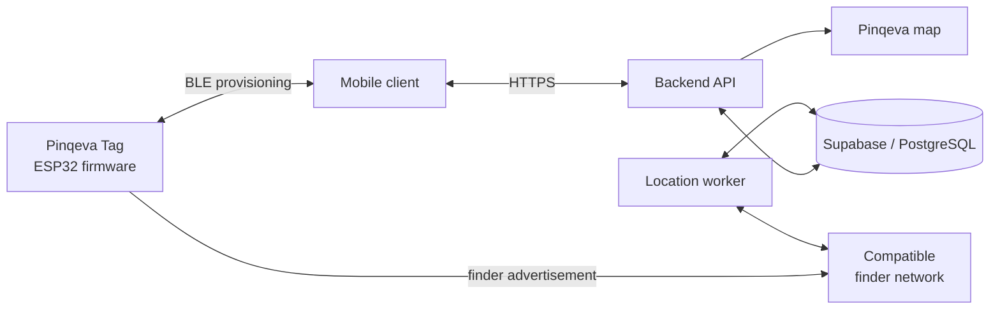
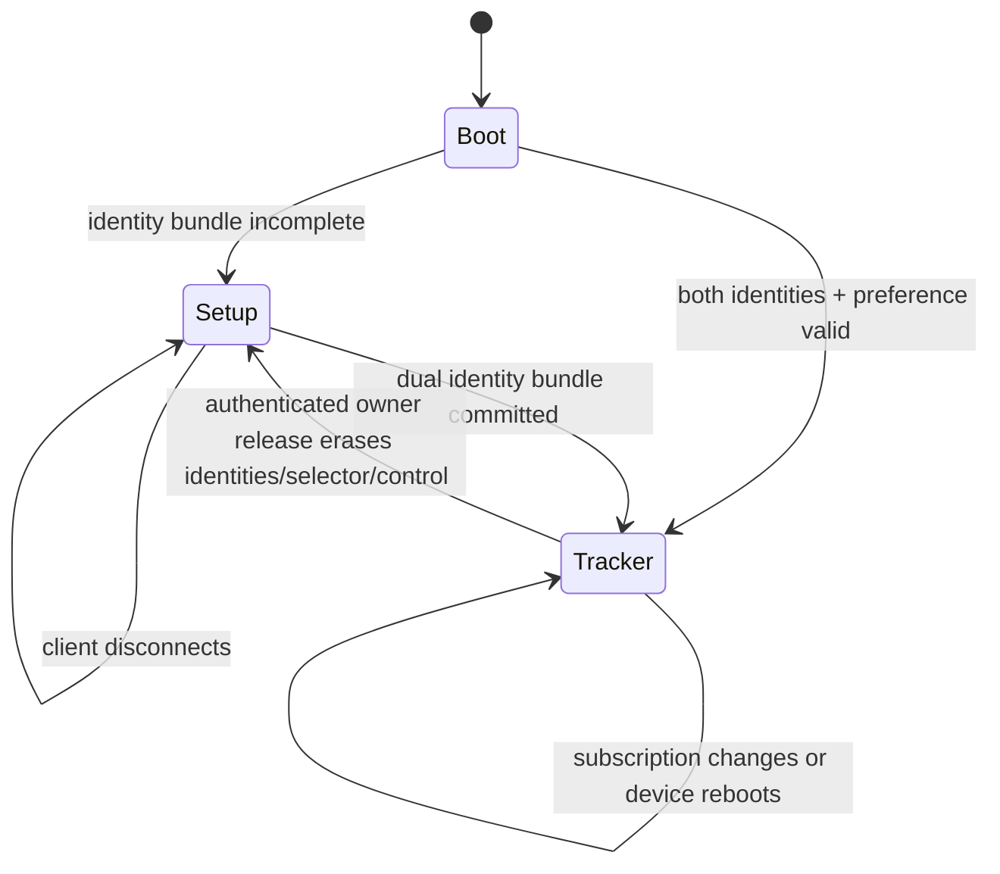

# Pinqeva

**Always know what is near.**

Pinqeva is a prototype Bluetooth item-tracking system built around an ESP32-based tag. The product is intended to combine a physical tracker, a mobile client, a backend service, subscription management, and a Pinqeva map showing the latest available location reports.

The same tag can be attached to personal belongings or left inside a vehicle. When used in a car, the application will associate the tag with owner-provided vehicle information and display the car's last reported location.

> Pinqeva is currently an engineering prototype. The key-provisioning backend, dual-network mobile setup, separate native Admin app, ESP32 GATT receiver, signed BLE firmware-update path, Stripe subscription workflow, premium tracker-service APIs, native map surface, and secured browser admin console exist; approved finder-network integration and final production validation are not yet complete.

## Project overview

The target system has five main parts:

1. **Pinqeva Tag** — a battery-powered ESP32-family device that transmits Bluetooth Low Energy advertisements.
2. **Mobile Client** — provisions the tag, manages the owner's devices and subscriptions, and displays locations.
3. **Backend and Database** — manage authentication, ownership, key material, subscriptions, payments, and location access.
4. **Location Worker** — retrieves compatible finder-network reports and stores normalized locations.
5. **Pinqeva Map** — displays a device or vehicle's latest report and bounded location history.



The complete architecture and proposed communication contract are documented in [System Architecture and Communication Protocol](docs/system-architecture-and-protocol.md).

## Current implementation status

| Area | Status | Current result |
|---|---|---|
| ESP32 application startup | Implemented | Initializes the status LED and starts BLE initialization in a FreeRTOS task. |
| Device identity | Implemented | Derives a stable `PKV-XXXXXXXXXXXX` identifier from the factory MAC address. |
| Firmware mode selection | Implemented provisioning slice | An incomplete dual-network bundle enters setup; both identities plus a setup preference enter tracker mode. Subscription state is not stored on the tag. |
| Setup mode | Implemented prototype | Advertises the provisioning service plus `PKV-XXXXXXXXXXXX`. The checked-in development profile bypasses bootstrap authentication and OS pairing/bonding; production still needs an authenticated application-layer confidential channel. |
| Tracker mode | Experimental dual-network implementation | One legacy BLE set alternates 500 ms Apple and Google slots at a 250 ms interval, targeting two frames from each network per second. Subscription expiry never disables the radio. |
| GATT event handling | Implemented provisioning, sound, and OTA slice | Protocol v1.8 adds both identities, a setup preference, QR-free per-connection authorization, public DULT non-owner sound control, a five-second maintenance gesture, and signed dual-slot BLE firmware updates. |
| Firmware updates | Implemented, hardware validation pending | The backend publishes an owner-scoped signed release, the native app streams and verifies it over BLE, and the ESP32 boots the inactive slot with rollback protection. The first partition-layout migration is wired. |
| Persistent storage | Implemented provisioning slice | Validates and reads back both identity fingerprints, selector, and control key; refuses replacement; authenticates destructive erasure; and clears BLE bonds after reset disconnect. |
| LED feedback | Implemented prototype | Provides setup and error feedback. Production patterns and non-blocking timing still need refinement. |
| Piezo sound | Implemented firmware path | Drives the CPT-9019A-SMT-TR on configurable GPIO25 at 4 kHz and implements 12-second DULT non-owner start/stop indications. Apple owner Play Sound still requires MFi. |
| Finder report integration | Experimental | The backend queries every configured Apple and Google identity independently, retains provider-tagged reports, and deterministically projects the newest report across both. Official platform approval remains external. |
| Supabase database | Premium backend implemented | Adds encrypted key custody, one-active-owner enforcement, one account subscription, provider-tagged 30-day location retention, safe zones, separation/vehicle protection, hashed recovery shares, smart alert delivery, admin RBAC/audit, and provider outbox rows. |
| Architecture and protocol | Draft complete | Defines the proposed hardware, software, BLE, HTTPS, vehicle, and subscription design. |
| Mobile client | Provisioning and firmware UI implemented | The authenticated product UI provisions the same dual-identity bundle on Android and iOS, verifies the complete binding, and supports signed BLE updates with interrupted-acknowledgement retry. Physical-device validation is still required. |
| Backend API and worker | Provisioning, premium location, firmware, billing, notification, and admin modules | Key custody, claims/releases, account billing, continuous Apple/Google report collection, 1–30 day retained history, phone-aware separation/movement alerts, recovery sharing/reporting, signed firmware, Stripe reconciliation, push scheduling, cancellation worker, MFA-gated administration, and audit are implemented. |
| Pinqeva map and vehicle UI | Map UI implemented; premium UI pending | iOS/Android use native Google Maps for stored tracker coordinates. Backend vehicle protection and movement alerts are implemented; the customer-facing controls still need to be wired to the new APIs. |
| Admin console | Implemented baseline | Separate in-memory-session browser console with Supabase TOTP MFA, server-enforced owner/admin roles, users, tracker maps, subscription grants/revocations, Stripe price versioning, device registration, and append-only audit. |
| Admin mobile app | Implemented baseline | Separate native iOS/Android app with its own bundle identity and encrypted session, Supabase TOTP MFA, role-gated operations, native tracker maps, subscriptions, pricing, device registration, administrator management, and audit views. |
| Subscription enforcement | Implemented cloud-side | One active/trialing account period unlocks cloud location, 30-day history, alerts, safe zones, recovery sharing/reporting, and vehicle protection for every currently owned tag. The ESP32 needs only its finder identities to advertise. |

## Current tag behavior

At startup, the provisioning firmware follows this decision:



- **Setup mode:** the LED indicates setup mode and the tag advertises `PKV-XXXXXXXXXXXX`. A phone can discover and connect to it.
- **Provisioning:** the app requires the dual-network/non-bonding capabilities, reads both fingerprints and the legacy startup preference, installs the control key, 20-byte Google EID, startup preference, and 28-byte Apple key only when empty, then waits for flash read-back confirmation. Android and iOS install the same bundle; the preference only selects the first 500 ms slot after boot. The checked-in development transport is not confidential and must be replaced by a reviewed application-layer secure channel for production.
- **Tracker mode:** one classic-ESP32 advertising set alternates 500 ms Apple and Google slots, each at a 250 ms interval. The frames are connectable for the public DULT non-owner sound service. Holding the physical button for five seconds opens Pinkeva maintenance advertising for two minutes, then dual advertising resumes.
- **Firmware update:** during that physical maintenance window, an authorized owner can install a strictly newer backend-signed ESP32 image into the inactive OTA slot. The tag verifies the signature, size, digest, and version before rebooting, and rolls back if the new image cannot initialize BLE.
- **Release/transfer:** the active owner obtains a backend-authenticated reset command. The tag erases both identities, selector, and control key; the backend ends that tag's ownership while leaving the account subscription unchanged; and the next owner receives a new dual-network bundle.

The implemented subscription boundary is:

```mermaid
stateDiagram-v2
    TagIdentity --> FinderAdvertising: valid dual bundle; Apple + Google slots
    Subscription --> PremiumCloud: active or trialing paid period
    Subscription --> NoPremiumCloud: expired or absent
    NoPremiumCloud -. does not change .-> FinderAdvertising
```

## Cloud subscription model

The physical tag keeps advertising whenever it has a valid finder identity. One active account subscription is required for Pinqeva's cloud service and premium safety tools.

- Billing is per account. One current/nonterminal subscription covers every tag the account currently owns; cancelled and ended rows remain as billing history.
- Active/trialing periods unlock cloud location requests and continuously collected, provider-tagged history retained for up to 30 days.
- Premium safety tools include phone-aware safe-zone departure and separation alerts, movement alerts, vehicle mode, expiring recovery links, recovery reports, eligible replacement claims, and tracker health/freshness overview.
- Recovery tokens are returned once, stored only as SHA-256 hashes, expire automatically, and can be revoked by the owner.
- When payment expires, cloud endpoints return a subscription-required response and premium links stop resolving; the ESP32 finder payload continues.
- Renewals are reconciled by signed Stripe webhooks and never require the phone to copy a new date to the tag.

The development-only entitlement transport has been removed from the API,
database end state, mobile client, and firmware. Physical-device validation and
production-grade transport confidentiality remain.

## Vehicle use case

A Pinqeva Tag may be left inside a car. The client application will allow the owner to associate information such as a nickname, make, model, year, colour, and optional registration number with that tag.

The app will combine the vehicle profile with the latest finder-network location report. If the vehicle is stolen, compatible phones inside or passing near the car may anonymously relay the tag's Bluetooth advertisement. A compatible device travelling with the vehicle may therefore help report where the car has moved.

This is crowd-sourced tracking, not continuous GPS:

- Reports depend on nearby compatible devices and network availability.
- A report can be delayed, inaccurate, or absent.
- The UI must display the observation time and report age.
- Pinqeva must not promise guaranteed or real-time vehicle recovery.
- Platform anti-stalking protections may alert someone travelling with an unknown tracker.
- Owners should provide useful information to the authorities and should not confront a suspected thief.

The tag does not currently provide speed, fuel level, engine state, mileage, or diagnostic information. That would require separate vehicle hardware.

## Repository structure

| Location | Contents |
|---|---|
| [`Test/Apple_FindMy_test/ESP32`](Test/Apple_FindMy_test/ESP32) | Current ESP-IDF tracker firmware, Pinkeva BLE provisioning service, and flash images. |
| [`Test/Apple_FindMy_test`](Test/Apple_FindMy_test) | Experimental key generation and Apple Find My report-retrieval scripts. |
| [`Test/anisette-v3-server`](Test/anisette-v3-server) | Experimental anisette server used by the report-retrieval test flow. |
| [`supabase/migrations`](supabase/migrations) | PostgreSQL schema, authentication profile trigger, and initial RLS policies. |
| [`supabase/seed.sql`](supabase/seed.sql) | Initial database seed data. |
| [`docs/system-architecture-and-protocol.md`](docs/system-architecture-and-protocol.md) | Hardware/software architecture, BLE protocol, API proposal, subscription model, and roadmap. |
| [`backend`](backend) | Authenticated provisioning API, key custody, manufacturing helper, and tests. |
| [`admin-panel`](admin-panel) | MFA-gated browser console for user, tracker, subscription, price, device, role, and audit operations. |
| [`admin-mobile-app`](admin-mobile-app) | Separate native Pinkeva Admin application for iOS and Android. |
| [`app-client`](app-client) | React Native App-to-Tag provisioning bridge and protocol tests. |
| [`google-findhub-bridge`](google-findhub-bridge) | Separately deployable experimental GPL service around the pinned GoogleFindMyTools development integration. |
| [`mobile-app`](mobile-app) | Customer-facing Expo/React Native product application for iOS, Android, and web; it contains no Admin console or privileged Admin API surface. |
| [`docs/provisioning-security-review.md`](docs/provisioning-security-review.md) | Threat scenarios, implemented controls, residual risks, and recovery decisions. |
| [`docs/supabase-cloud-deployment.md`](docs/supabase-cloud-deployment.md) | Hosted database, Auth-provider, backend-secret, and mobile setup. |

## Building the firmware

The provisioning firmware targets the classic ESP32 and is built with ESP-IDF 5.4 for `esp32`. The checked-in application image contains the Pinkeva setup service `a6f0f000-3e4d-4b1a-9c2e-72d24c8f0a01`. The exact production module, flash size, GPIO mapping, RF design, and hardware behavior still require on-device validation.

Install and activate ESP-IDF, then build from the firmware directory:

```sh
cd Test/Apple_FindMy_test/ESP32
idf.py set-target esp32
idf.py build
```

To flash the checked-in classic ESP32 OTA layout without erasing the per-device
NVS/bootstrap key:

```sh
./flash_esp32.sh --port /dev/tty.usbmodemXXXX
```

Replace the port with the connected board's serial interface. This wired bundle
installs the bootloader, dual-slot partition table, initial OTA metadata, and
firmware `0.6.0`; it is required once for boards on the old single-app layout.
Later releases can be installed from the mobile firmware screen. Firmware
behavior must still be validated on real hardware; a successful build and the
UUID in the image are not a substitute for testing the exact board.

## Next milestone

The next milestone validates key-based advertising and premium cloud boundaries on hardware, then completes production hardening:

1. Validate the implemented per-device challenge-response on hardware, then add a reviewed application-layer encrypted no-bond channel, physical presence/OOB, and a tag-signed provisioning receipt.
2. Test scan, no-bond connection, dual-identity persistence, one-network-only advertising, reboot, OTA writes, disconnect, power loss, digest/signature rejection, rollback, and confirmation on the target ESP32 hardware with iOS and Android.
3. Validate provisioning, account billing, 30-day history, safe zones, separation/movement alerts, recovery sharing, and expiry/renewal behavior on physical iOS and Android devices.
4. Move private-key envelope encryption to a managed KMS/HSM and restrict decryption to the location collector.

After this contract is tested end to end, the rest of the client, backend, map, vehicle profile, and payment experience can be developed against a stable interface.

## Important limitations

- Pinqeva is a Bluetooth item tracker prototype, not a finished or certified AirTag. AirTag is an Apple trademark.
- Compatible Apple Find My and Google Find Hub operation is experimental. A commercial product requires each platform's program enrollment, approval, anti-stalking behavior, and certification. The current Google EID/report bridge is a development path, not official consumer enrollment.
- The ESP32 tracker has no GNSS, cellular connection, or UWB and does not independently determine its global position.
- BLE RSSI can indicate rough proximity but cannot provide an exact direction or global position.
- Private finder keys and real user credentials must not be committed, logged, embedded in the mobile client, or written to the tag.
- Battery life, RF performance, security, privacy, and regulatory compliance require testing on the final hardware.
- Location history and vehicle registration data are sensitive personal information and require appropriate access control, retention, export, and deletion policies.

## Documentation

Start with the [System Architecture and Communication Protocol](docs/system-architecture-and-protocol.md). It records the current implementation, target design, protocol UUIDs, state transitions, security boundaries, premium cloud APIs, dual-network behavior, and next milestone.

The report is a draft and should be updated whenever an architectural decision becomes implemented or changes.
