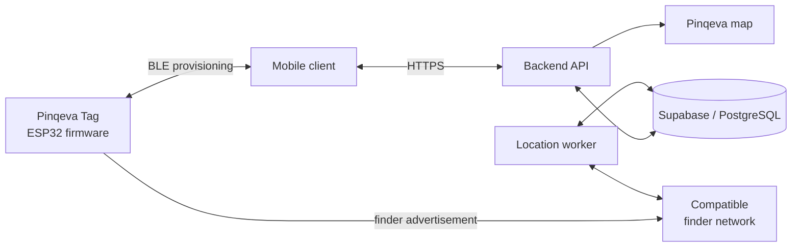
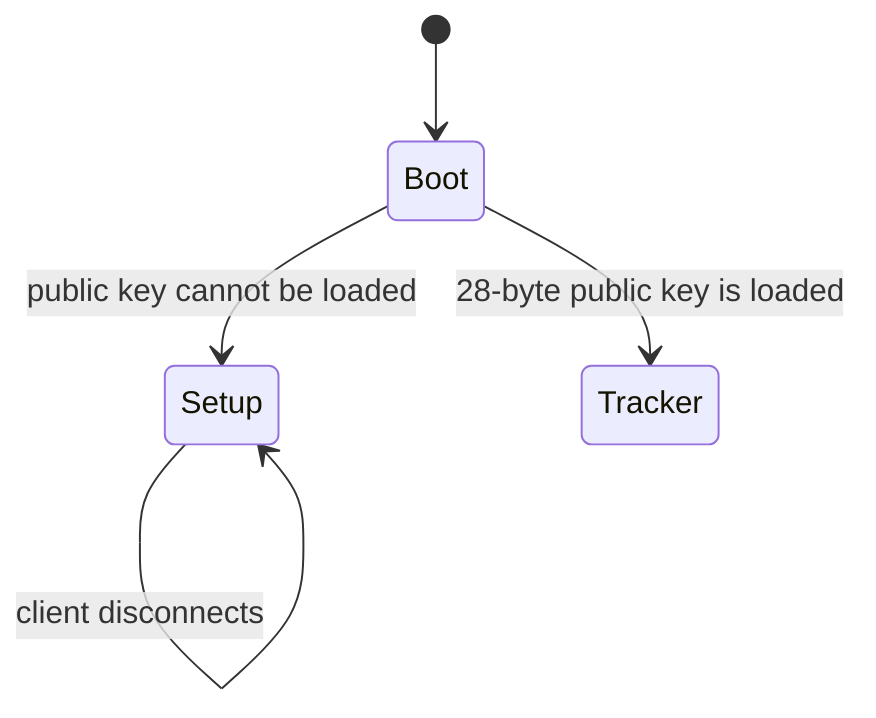
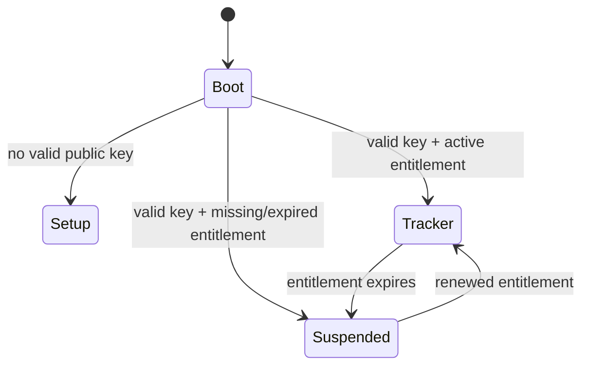

# Pinqeva

**Always know what is near.**

Pinqeva is a prototype Bluetooth item-tracking system built around an ESP32-based tag. The product is intended to combine a physical tracker, a mobile client, a backend service, subscription management, and a Pinqeva map showing the latest available location reports.

The same tag can be attached to personal belongings or left inside a vehicle. When used in a car, the application will associate the tag with owner-provided vehicle information and display the car's last reported location.

> Pinqeva is currently an engineering prototype. The firmware and database foundations exist, but the mobile client, backend API, map, complete provisioning service, and subscription enforcement are not yet implemented.

## Project overview

The target system has five main parts:

1. **Pinqeva Tag** — a battery-powered ESP32-family device that transmits Bluetooth Low Energy advertisements.
2. **Mobile Client** — provisions the tag, manages the owner's devices and subscriptions, and displays locations.
3. **Backend and Database** — manage authentication, ownership, key material, subscriptions, payments, and location access.
4. **Location Worker** — retrieves compatible finder-network reports and stores normalized locations.
5. **Pinqeva Map** — displays a device or vehicle's latest report and bounded location history.



The complete architecture and proposed communication contract are documented in [System Architecture and Communication Protocol](docs/system-architecture-and-protocol.md).

## Current implementation status

| Area | Status | Current result |
|---|---|---|
| ESP32 application startup | Implemented | Initializes the status LED and starts BLE initialization in a FreeRTOS task. |
| Device identity | Implemented | Derives a stable `PKV-XXXXXXXXXXXX` identifier from the factory MAC address. |
| Firmware mode selection | Implemented prototype | Attempts to load a 28-byte public key. A readable key enters tracker mode; otherwise the device enters setup mode. Erased/invalid key validation still needs to be added. |
| Setup mode | Implemented prototype | Sends a connectable BLE advertisement using the public address and Pinqeva device name. Advertising restarts after disconnection. |
| Tracker mode | Implemented prototype | Builds a non-connectable, manufacturer-specific advertisement from the 28-byte public key and derives a random BLE address from it. |
| GATT event handling | Partial | Registration, connection, disconnection, read, write, and MTU callbacks exist, but the provisioning service and characteristics are not created yet. |
| Persistent storage | Partial | NVS initialization and key reads exist. Runtime key save, validation, read-back verification, and authorized erase are not implemented. |
| LED feedback | Implemented prototype | Provides setup and error feedback. Production patterns and non-blocking timing still need refinement. |
| Finder report experiments | Experimental | Contains key-generation and report-retrieval tests based on OpenHaystack/pypush, plus an anisette test server. |
| Supabase database | Partial | Defines profiles, devices, ownership, plans, subscriptions, invoices, payment events, and initial Row Level Security policies. |
| Architecture and protocol | Draft complete | Defines the proposed hardware, software, BLE, HTTPS, vehicle, and subscription design. |
| Mobile client | Not implemented | No Pinqeva iOS/Android client is currently checked in. |
| Backend API and worker | Not implemented | Provisioning, device claim, entitlement issuance, and location processing still need to be built. |
| Pinqeva map and vehicle UI | Not implemented | The map, location history, and vehicle profile experience are currently architectural requirements. |
| Subscription enforcement | Not implemented | Signed entitlements and the firmware's subscription-suspended state are designed but not yet coded. |

## Current tag behavior

At startup, the prototype follows this decision:



- **Setup mode:** the LED indicates setup mode and the tag advertises `PKV-XXXXXXXXXXXX`. A phone can discover and connect to it.
- **Tracker mode:** the tag constructs and transmits its tracker advertisement from the stored public key.
- **Current limitation:** a phone can connect in setup mode, but it cannot yet provision and persist the key because the GATT service and write path are unfinished.

The target behavior adds subscription verification:



## Mandatory subscription model

An active subscription is required to use the tag as a finder-network tracker.

- The backend will issue a signed, device-bound subscription entitlement after confirming payment.
- The mobile application will transfer that entitlement to the tag over BLE.
- Firmware will verify the backend signature, device binding, anti-rollback value, and expiry.
- A tag will transmit finder-network advertising data only while its entitlement is valid.
- When the subscription expires, the finder payload will stop.
- The public key will remain stored and the tag will expose only a low-duty-cycle maintenance channel so the owner can renew the subscription.

This enforcement is part of the agreed architecture but is **not implemented in the current firmware yet**.

## Vehicle use case

A Pinqeva Tag may be left inside a car. The client application will allow the owner to associate information such as a nickname, make, model, year, colour, and optional registration number with that tag.

The app will combine the vehicle profile with the latest finder-network location report. If the vehicle is stolen, compatible phones inside or passing near the car may anonymously relay the tag's Bluetooth advertisement. A compatible device travelling with the vehicle may therefore help report where the car has moved.

This is crowd-sourced tracking, not continuous GPS:

- Reports depend on nearby compatible devices and network availability.
- A report can be delayed, inaccurate, or absent.
- The UI must display the observation time and report age.
- Pinqeva must not promise guaranteed or real-time vehicle recovery.
- Platform anti-stalking protections may alert someone travelling with an unknown tracker.
- Owners should provide useful information to the authorities and should not confront a suspected thief.

The tag does not currently provide speed, fuel level, engine state, mileage, or diagnostic information. That would require separate vehicle hardware.

## Repository structure

| Location | Contents |
|---|---|
| [`Test/Apple_FindMy_test/ESP32`](Test/Apple_FindMy_test/ESP32) | Current ESP-IDF tracker firmware and archived test artifacts. |
| [`Test/Apple_FindMy_test`](Test/Apple_FindMy_test) | Experimental key generation and Apple Find My report-retrieval scripts. |
| [`Test/anisette-v3-server`](Test/anisette-v3-server) | Experimental anisette server used by the report-retrieval test flow. |
| [`supabase/migrations`](supabase/migrations) | PostgreSQL schema, authentication profile trigger, and initial RLS policies. |
| [`supabase/seed.sql`](supabase/seed.sql) | Initial database seed data. |
| [`docs/system-architecture-and-protocol.md`](docs/system-architecture-and-protocol.md) | Hardware/software architecture, BLE protocol, API proposal, subscription model, and roadmap. |

## Building the firmware

The current checked-in ESP-IDF configuration targets the original Xtensa ESP32 with 2 MB of flash. Although earlier project descriptions mentioned ESP32-C3, the final production microcontroller has not been selected.

Install and activate ESP-IDF, then run:

```powershell
Set-Location Test/Apple_FindMy_test/ESP32
idf.py build
```

To flash and monitor a connected development board:

```powershell
idf.py -p COMx flash monitor
```

Replace `COMx` with the board's serial port. Firmware behavior must be validated on real hardware; the presence of checked-in build artifacts is not proof that the current source builds or works on every target.

## Next milestone

The next milestone is one complete provisioning and subscription vertical slice:

1. Create the proposed Pinqeva GATT service and characteristics.
2. Implement strict 28-byte public-key validation and atomic persistent storage.
3. Implement signed entitlement storage and verification.
4. Add the `Subscription Suspended` firmware state.
5. Test scan, connect, read, write, confirmation, reboot, expiry, and renewal with a BLE test client.
6. Build the minimum mobile provisioning screen.
7. Add an idempotent backend provisioning and device-claim operation.
8. Bind the successfully provisioned tag to the authenticated owner's account.

After this contract is tested end to end, the rest of the client, backend, map, vehicle profile, and payment experience can be developed against a stable interface.

## Important limitations

- Pinqeva is a Bluetooth item tracker prototype, not a finished or certified AirTag. AirTag is an Apple trademark.
- Compatible Apple Find My operation is experimental. A commercial product requires the appropriate Apple program enrollment, approval, anti-stalking behavior, and certification.
- The ESP32 tracker has no GNSS, cellular connection, or UWB and does not independently determine its global position.
- BLE RSSI can indicate rough proximity but cannot provide an exact direction or global position.
- Private finder keys and real user credentials must not be committed, logged, embedded in the mobile client, or written to the tag.
- Battery life, RF performance, security, privacy, and regulatory compliance require testing on the final hardware.
- Location history and vehicle registration data are sensitive personal information and require appropriate access control, retention, export, and deletion policies.

## Documentation

Start with the [System Architecture and Communication Protocol](docs/system-architecture-and-protocol.md). It records the current implementation, target design, protocol UUIDs, state transitions, security boundaries, subscription entitlement format, proposed API, and next milestone.

The report is a draft and should be updated whenever an architectural decision becomes implemented or changes.
