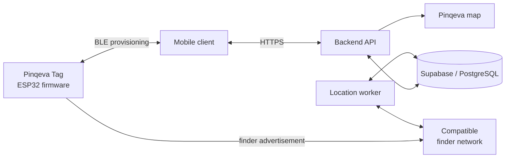
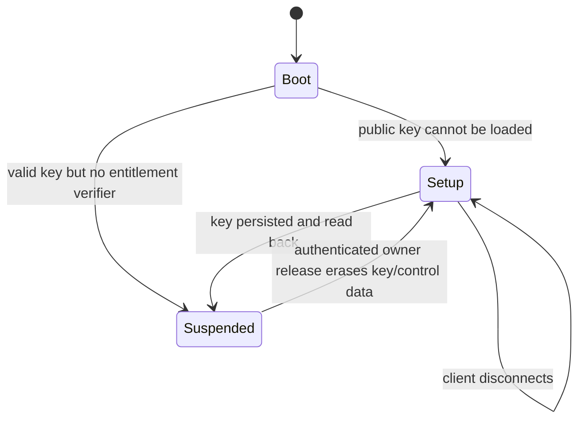
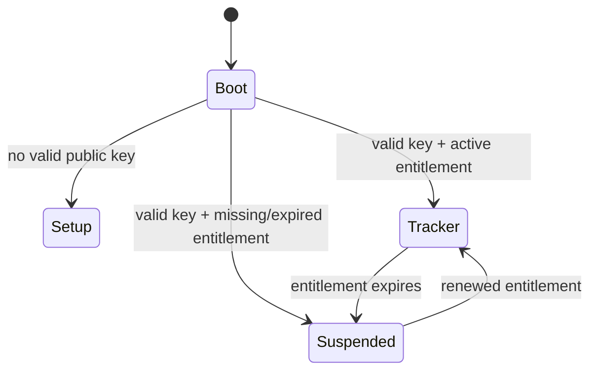

# Pinqeva

**Always know what is near.**

Pinqeva is a prototype Bluetooth item-tracking system built around an ESP32-based tag. The product is intended to combine a physical tracker, a mobile client, a backend service, subscription management, and a Pinqeva map showing the latest available location reports.

The same tag can be attached to personal belongings or left inside a vehicle. When used in a car, the application will associate the tag with owner-provided vehicle information and display the car's last reported location.

> Pinqeva is currently an engineering prototype. The key-provisioning backend, App-to-Tag client module, ESP32-C3 GATT receiver, and database foundation exist; the product UI, signed entitlements, report worker, map, and production hardening are not yet complete.

## Project overview

The target system has five main parts:

1. **Pinqeva Tag** — a battery-powered ESP32-family device that transmits Bluetooth Low Energy advertisements.
2. **Mobile Client** — provisions the tag, manages the owner's devices and subscriptions, and displays locations.
3. **Backend and Database** — manage authentication, ownership, key material, subscriptions, payments, and location access.
4. **Location Worker** — retrieves compatible finder-network reports and stores normalized locations.
5. **Pinqeva Map** — displays a device or vehicle's latest report and bounded location history.



The complete architecture and proposed communication contract are documented in [System Architecture and Communication Protocol](docs/system-architecture-and-protocol.md).

## Current implementation status

| Area | Status | Current result |
|---|---|---|
| ESP32 application startup | Implemented | Initializes the status LED and starts BLE initialization in a FreeRTOS task. |
| Device identity | Implemented | Derives a stable `PKV-XXXXXXXXXXXX` identifier from the factory MAC address. |
| Firmware mode selection | Implemented provisioning slice | A missing key enters setup; a valid committed key without an entitlement fails closed into suspended maintenance mode. |
| Setup mode | Implemented | Advertises the provisioning service plus `PKV-XXXXXXXXXXXX`, accepts encrypted connections, and resumes after disconnect. |
| Tracker mode | Blocked by entitlement | Finder advertising is intentionally disabled until signed entitlement verification is implemented. |
| GATT event handling | Implemented provisioning slice | Protocol v1.1 exposes identity/status, encrypted key fingerprints, one-time control/key writes, and HMAC-authenticated reset. |
| Persistent storage | Implemented provisioning slice | Validates and reads back the key/control pair, refuses replacement, authenticates destructive erasure, and clears BLE bonds after reset disconnect. |
| LED feedback | Implemented prototype | Provides setup and error feedback. Production patterns and non-blocking timing still need refinement. |
| Finder report experiments | Experimental | Contains key-generation and report-retrieval tests based on OpenHaystack/pypush, plus an anisette test server. |
| Supabase database | Partial | Adds encrypted key custody, permanent device allocation, idempotency, one-active-owner enforcement, audited release, subscription cancellation, and provider outbox rows. |
| Architecture and protocol | Draft complete | Defines the proposed hardware, software, BLE, HTTPS, vehicle, and subscription design. |
| Mobile client | Provisioning module | A typed React Native service verifies tag/QR identity and fingerprints, safely claims/resumes, and performs authenticated two-phase release. A product UI is still needed. |
| Backend API and worker | Provisioning module | Conditional one-time key generation, encrypted private-key custody, one-owner claim, release, and local subscription cancellation are implemented. The payment outbox worker, entitlements, and location worker remain. |
| Pinqeva map and vehicle UI | Not implemented | The map, location history, and vehicle profile experience are currently architectural requirements. |
| Subscription enforcement | Fail-closed placeholder | Suspended state is enforced; signed lease issuance and verification remain to be implemented. |

## Current tag behavior

At startup, the provisioning firmware follows this decision:



- **Setup mode:** the LED indicates setup mode and the tag advertises `PKV-XXXXXXXXXXXX`. A phone can discover and connect to it.
- **Provisioning:** the app reads the encrypted stored-key fingerprint, installs a 32-byte control key followed by exactly 28 advertisement-key bytes only when empty, and waits for explicit flash read-back confirmation.
- **Suspended mode:** the public advertisement key remains stored and the maintenance service stays available, but no finder payload is emitted without a signed entitlement.
- **Release/transfer:** the active owner obtains a backend-authenticated reset command. The tag erases key/control data, the backend ends the single ownership and cancels device subscriptions, and the next owner receives a newly generated keypair.

The target behavior adds subscription verification:



## Mandatory subscription model

An active subscription is required to use the tag as a finder-network tracker.

- The backend will issue a signed, device-bound subscription entitlement after confirming payment.
- The mobile application will transfer that entitlement to the tag over BLE.
- Firmware will verify the backend signature, device binding, anti-rollback value, and expiry.
- A tag will transmit finder-network advertising data only while its entitlement is valid.
- When the subscription expires, the finder payload will stop.
- The public key will remain stored and the tag will expose only a low-duty-cycle maintenance channel so the owner can renew the subscription.

Fail-closed suspension is implemented. Entitlement generation, signature verification, trusted time, renewal, and activation are **not implemented yet**.

## Vehicle use case

A Pinqeva Tag may be left inside a car. The client application will allow the owner to associate information such as a nickname, make, model, year, colour, and optional registration number with that tag.

The app will combine the vehicle profile with the latest finder-network location report. If the vehicle is stolen, compatible phones inside or passing near the car may anonymously relay the tag's Bluetooth advertisement. A compatible device travelling with the vehicle may therefore help report where the car has moved.

This is crowd-sourced tracking, not continuous GPS:

- Reports depend on nearby compatible devices and network availability.
- A report can be delayed, inaccurate, or absent.
- The UI must display the observation time and report age.
- Pinqeva must not promise guaranteed or real-time vehicle recovery.
- Platform anti-stalking protections may alert someone travelling with an unknown tracker.
- Owners should provide useful information to the authorities and should not confront a suspected thief.

The tag does not currently provide speed, fuel level, engine state, mileage, or diagnostic information. That would require separate vehicle hardware.

## Repository structure

| Location | Contents |
|---|---|
| [`Test/Apple_FindMy_test/ESP32`](Test/Apple_FindMy_test/ESP32) | Current ESP-IDF tracker firmware and archived test artifacts. |
| [`Test/Apple_FindMy_test`](Test/Apple_FindMy_test) | Experimental key generation and Apple Find My report-retrieval scripts. |
| [`Test/anisette-v3-server`](Test/anisette-v3-server) | Experimental anisette server used by the report-retrieval test flow. |
| [`supabase/migrations`](supabase/migrations) | PostgreSQL schema, authentication profile trigger, and initial RLS policies. |
| [`supabase/seed.sql`](supabase/seed.sql) | Initial database seed data. |
| [`docs/system-architecture-and-protocol.md`](docs/system-architecture-and-protocol.md) | Hardware/software architecture, BLE protocol, API proposal, subscription model, and roadmap. |
| [`backend`](backend) | Authenticated provisioning API, key custody, manufacturing helper, and tests. |
| [`app-client`](app-client) | React Native App-to-Tag provisioning bridge and protocol tests. |
| [`docs/provisioning-security-review.md`](docs/provisioning-security-review.md) | Threat scenarios, implemented controls, residual risks, and recovery decisions. |

## Building the firmware

The provisioning firmware has an ESP32-C3 baseline and has been compiled with ESP-IDF 5.4 for `esp32c3`. The exact ESP32-C3-MINI board, flash size, GPIO mapping, RF design, and hardware behavior still require on-device validation.

Install and activate ESP-IDF, then run:

```powershell
Set-Location Test/Apple_FindMy_test/ESP32
idf.py -B build-c3 -DIDF_TARGET=esp32c3 -DSDKCONFIG=sdkconfig.c3 build
```

To flash and monitor a connected development board:

```powershell
idf.py -p COMx flash monitor
```

Replace `COMx` with the board's serial port. Firmware behavior must be validated on real hardware; the presence of checked-in build artifacts is not proof that the current source builds or works on every target.

## Next milestone

The next milestone completes subscription authorization and proves this slice on hardware:

1. Add QR/OOB or physical-presence authenticated BLE pairing and a tag-signed provisioning receipt.
2. Implement signed entitlement issuance, atomic storage, signature/device/counter/expiry checks, and trusted time.
3. Activate finder advertising only after entitlement verification and stop it at expiry.
4. Test scan, pairing, fragmented write, disconnect, flash failure, confirmation, reboot, expiry, and renewal on ESP32-C3-MINI with iOS and Android.
5. Build the product provisioning UI around the checked-in app service.
6. Move private-key envelope encryption to a managed KMS/HSM and implement location-worker-only decryption.

After this contract is tested end to end, the rest of the client, backend, map, vehicle profile, and payment experience can be developed against a stable interface.

## Important limitations

- Pinqeva is a Bluetooth item tracker prototype, not a finished or certified AirTag. AirTag is an Apple trademark.
- Compatible Apple Find My operation is experimental. A commercial product requires the appropriate Apple program enrollment, approval, anti-stalking behavior, and certification.
- The ESP32 tracker has no GNSS, cellular connection, or UWB and does not independently determine its global position.
- BLE RSSI can indicate rough proximity but cannot provide an exact direction or global position.
- Private finder keys and real user credentials must not be committed, logged, embedded in the mobile client, or written to the tag.
- Battery life, RF performance, security, privacy, and regulatory compliance require testing on the final hardware.
- Location history and vehicle registration data are sensitive personal information and require appropriate access control, retention, export, and deletion policies.

## Documentation

Start with the [System Architecture and Communication Protocol](docs/system-architecture-and-protocol.md). It records the current implementation, target design, protocol UUIDs, state transitions, security boundaries, subscription entitlement format, proposed API, and next milestone.

The report is a draft and should be updated whenever an architectural decision becomes implemented or changes.
