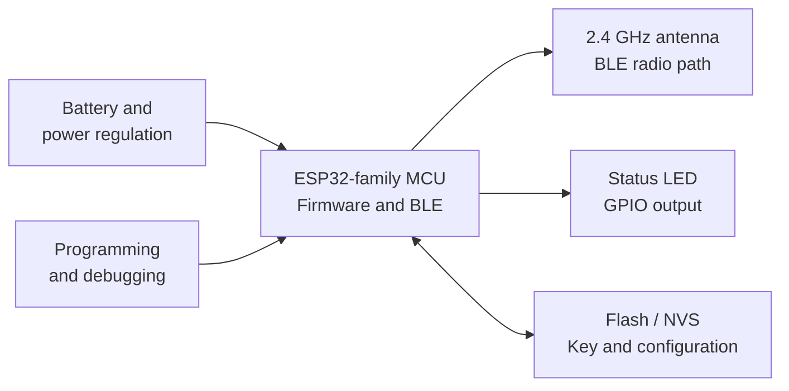
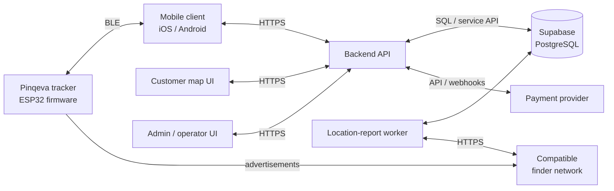
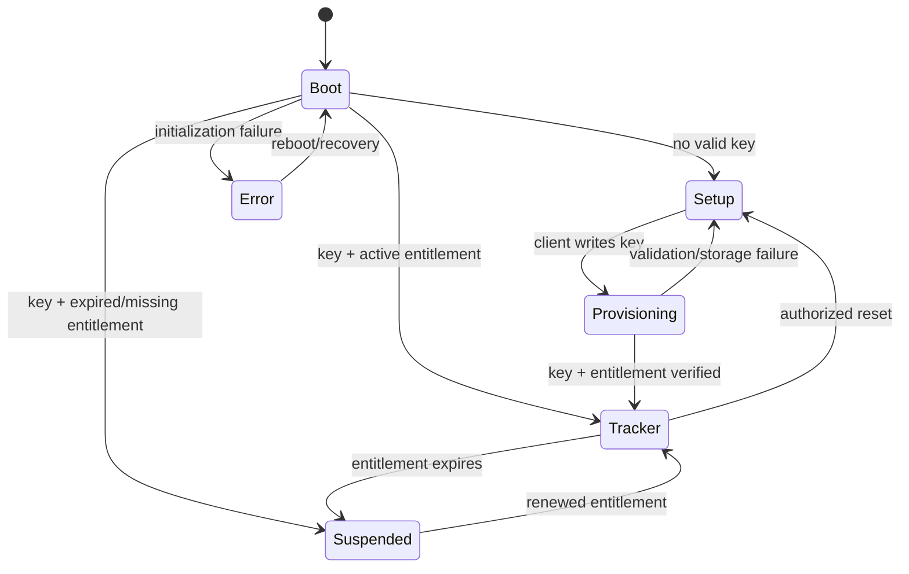

# Pinqeva System Architecture and Communication Protocol

> **Document version:** 0.4 — Payment-gated provisioning and subscription entitlement implementation<br>
> **Date:** 25 August 2026<br>
> **Repository:** [PROJECT_PINKEVA_TAG_w_SUBS](https://github.com/Th0masclassic/PROJECT_PINKEVA_TAG_w_SUBS)<br>
> **Purpose:** Architecture baseline before client and server development

*Always know what is near.*

This is a living architecture document. It explicitly separates behavior already implemented in the test project from behavior proposed for the complete Pinqeva product.

## Motivation

People regularly misplace personal items such as wallets, keys, bags, cards, and even parked vehicles. A compact Bluetooth tracker can help an owner identify a nearby item and, when integrated with a compatible finder network, obtain time-stamped location reports generated by participating devices.

A particularly useful Pinqeva scenario is leaving a tracker inside a car. The application can remember the vehicle's information and show the latest reported position on the Pinqeva map. This helps the owner find a parked car and may also assist after theft. In that situation, compatible phones travelling inside or passing near the stolen vehicle may anonymously relay the tracker's signal to the finder network. Ironically, a compatible device carried by someone moving with the vehicle may contribute to reporting the vehicle's location.

This is a crowd-sourced location mechanism, not a covert, continuous GPS system. Reports depend on nearby compatible devices, network availability, and the finder service. They can be delayed or absent, and platform anti-stalking protections may notify a person travelling with an unknown tracker. Pinqeva must display each report's timestamp and must not promise an exact, real-time, or guaranteed stolen-vehicle recovery service.

Pinqeva combines this tracking capability with a dedicated mobile experience, clear device ownership, an in-application map, and subscription-controlled tracker operation and cloud services. An active subscription is required for the tag to transmit its finder-network advertising payload. Pinqeva is therefore an end-to-end system composed of physical hardware, firmware, a mobile client, a backend service, a database, subscription management, an administration interface, and a map where an authenticated owner can view the latest available position and location history.

Defining the architecture and protocol before implementing the client and server reduces ambiguity between components. The firmware and mobile application must agree on Bluetooth services, key sizes, message formats, state transitions, result codes, and recovery behavior. The mobile application and backend must also agree on authentication, device ownership, subscription state, and location-report APIs.

The current repository contains ESP32 test firmware, experimental Apple Find My report-retrieval scripts, an anisette test server, and a Supabase/PostgreSQL schema for users, devices, ownership, plans, subscriptions, invoices, and payment events. This document organizes these elements into one coherent target architecture.

## Índice

1. [Introduction](#1-introduction)
2. [Hardware Architecture](#2-hardware-architecture)
3. [Software Architecture](#3-software-architecture)
4. [Communication Protocol](#4-communication-protocol)
5. [Current Implementation Status and Next Milestone](#5-current-implementation-status-and-next-milestone)
6. [Conclusion](#6-conclusion)

## 1. Introduction

### 1.1 Purpose

This document defines the hardware architecture, software architecture, and communication boundaries of the Pinqeva tracker system. It guides the next development stages: completing firmware provisioning, building the mobile client, implementing the backend, and connecting the map and subscription experience.

### 1.2 Scope

The complete system contains:

- A battery-powered Bluetooth tracker controlled by an ESP32-family microcontroller.
- Embedded firmware with setup, tracker, and subscription-suspended modes.
- An iOS/Android client application for provisioning, management, and location display.
- A backend API responsible for authentication, device ownership, key lifecycle, subscriptions, and location access.
- A PostgreSQL database currently managed through Supabase.
- A background worker that retrieves and processes finder-network location reports.
- A customer map interface for current and historical locations.
- An optional vehicle profile associated with a tracker, containing owner-provided details such as vehicle nickname, make, model, year, colour, and registration number.
- An administration interface for support and operational management.
- A payment-provider integration for subscription and invoice events.

Pinqeva must be described as a Bluetooth item tracker rather than an AirTag. Apple Find My support is experimental in the current test project. A commercial product requires the appropriate Apple program enrollment, approval, anti-stalking behavior, and certification.

The tracker does not contain GNSS, cellular connectivity, or UWB. It therefore does not independently calculate or transmit its global position. Nearby BLE can provide discovery and a rough signal-strength indication. Global map coordinates are obtained from compatible finder-network reports and processed by the backend.

When the tracker is placed in a car, Pinqeva retrieves the latest location report associated with the tag and combines it with the vehicle profile stored in the application. The tag cannot retrieve vehicle telemetry such as speed, fuel level, engine state, mileage, or diagnostic codes unless separate vehicle hardware is added in the future.

### 1.3 Status terminology

- **Current:** the behavior exists in the checked-in test firmware or database migrations.
- **Proposed:** the behavior belongs to the target design but is not yet fully implemented.

### 1.4 Architectural principles

- **BLE first:** the tracker communicates locally with the mobile application through Bluetooth Low Energy.
- **Least privilege:** users access only devices they actively own; administrative functions require separate authorization.
- **Private-key isolation:** the private key used to decrypt location reports never enters the tracker and remains in protected server-side storage.
- **Explicit device states:** firmware distinguishes unprovisioned, provisioning, active, subscription-suspended, and error states.
- **Server authority:** identity, ownership, payments, subscription state, and location access are enforced by the backend.
- **No invented precision:** the UI shows the timestamp and freshness of crowd-sourced reports instead of presenting them as real-time GPS.
- **Subscription enforcement:** an active, cryptographically signed entitlement is required before firmware transmits the finder-network advertising payload.
- **Recoverable suspension:** an expired tag stops finder advertising but retains a minimal maintenance channel so the owner can renew and reactivate it.

## 2. Hardware Architecture

### 2.1 Physical tracker

The prototype tracker consists of:

- An ESP32-family microcontroller with Bluetooth Low Energy.
- Integrated flash storage for firmware and persistent provisioning data.
- A status LED connected to a GPIO output.
- A 2.4 GHz antenna, integrated into the module or implemented on the PCB.
- A battery and power-regulation circuit.
- A programming and debugging connection.
- Optional future hardware such as a buzzer, push button, battery monitor, or charging circuit.

The provisioning configuration now targets ESP32-C3 and compiles with ESP-IDF 5.4. The exact ESP32-C3-MINI module, flash capacity, GPIO mapping, memory use, RF design, and power profile must still be validated before the production PCB is frozen.

### 2.2 Hardware block diagram



### 2.3 Microcontroller responsibilities

The microcontroller is responsible for:

- Initializing non-volatile storage and Bluetooth.
- Deriving a stable device identifier from the factory MAC address.
- Determining whether a valid 28-byte advertisement public key exists.
- Validating a signed subscription entitlement and its expiry time.
- Starting connectable setup advertising when the key is absent.
- Exposing the provisioning GATT service to the mobile application.
- Validating and persistently storing the advertisement key.
- Starting non-connectable tracker advertising only when provisioning is complete and the subscription entitlement is active.
- Stopping the finder-network payload when the entitlement expires.
- Controlling the status LED and reporting initialization errors.

The microcontroller does not process payments or decide whether a subscription is paid. The backend is authoritative for billing; the microcontroller only enforces a signed entitlement issued by that backend. It is also not responsible for user authentication, private-key storage, map rendering, or global report retrieval.

### 2.4 Bluetooth operating modes

| Mode | Advertising | Address | Interval | Connectable | Purpose |
|---|---|---|---|---|---|
| Setup | BLE setup advertisement | Public | 100–250 ms | Yes | Allow the mobile client to discover and provision a new tracker. |
| Tracker | Finder-network advertisement | Random, derived from public key | 1–2 s in prototype | No | Broadcast the tracker payload while the signed entitlement is active. |
| Suspended | Maintenance/renewal only; no finder payload | Public or dedicated maintenance address | Low duty cycle | Yes | Allow renewal without transmitting tracker advertising data. |

During setup, the current firmware advertises the name `PKV-XXXXXXXXXXXX`, where the final twelve hexadecimal characters are derived from the factory MAC address. This identifier supports discovery and technical support, but it is not proof of ownership.

### 2.5 Persistent storage

**Current:** firmware stores the protocol-v1.2 factory bootstrap key, advertisement key, and reset-control key as NVS blobs. It rejects invalid values, refuses ordinary replacement, commits and reads back owner keys, and exposes only the SHA-256 advertisement-key fingerprint. An owner release must carry a valid per-allocation HMAC before advertisement/control blobs are erased; the factory bootstrap key survives transfer. NVS initialization fails closed instead of silently erasing provisioned data.

**Proposed:** the storage module provides:

- Atomic storage of the 28-byte advertisement key.
- A provisioning marker and storage-format version.
- Detection of erased values such as all `0xFF` bytes and invalid values such as all zeroes.
- Read-back verification before tracker activation.
- Controlled erase during an authorized factory reset.
- Compatibility with flash encryption in production.

NVS blob storage is suitable for the first runtime implementation. A dedicated encrypted partition can be adopted later if manufacturing or security requirements justify it.

### 2.6 LED feedback

| LED behavior | Meaning |
|---|---|
| Slow setup indication | Device is unprovisioned and waiting for the mobile application. |
| Short confirmation pattern | Provisioning completed successfully. |
| Repeated error pattern | Initialization, storage, or Bluetooth failure. |
| Off during normal tracking | Tracker is operating normally and conserving power. |

LED activity should be controlled by a task or timer so long visual patterns do not block Bluetooth event processing.

### 2.7 Power considerations

BLE advertising interval, transmission power, LED duration, CPU wake time, and the power-regulation circuit directly affect battery life. Persistent Wi-Fi or MQTT connectivity is not part of the low-power tracker path. Battery-life claims require measurements on the final PCB, antenna, battery, firmware, and enclosure.

## 3. Software Architecture

### 3.1 System overview



The tracker communicates directly only with nearby BLE clients and the finder network through advertisements. It does not communicate directly with the database, payment provider, administration interface, or map.

### 3.2 Firmware architecture

The firmware is divided into these responsibilities:

- **Application entry point:** initializes the LED and starts Bluetooth initialization in a FreeRTOS task.
- **BLE driver:** configures GAP advertising, registers GATT callbacks, manages connections, and selects setup or tracker behavior.
- **Storage driver:** initializes NVS and will provide validated key save, load, and erase operations.
- **Utility and LED module:** controls GPIO output and provides visible error feedback.
- **Provisioning service:** owns the GATT database, characteristic handles, protocol validation, and transition to tracker mode.
- **Entitlement verifier:** validates signed subscription leases, tracks expiry, and suspends finder advertising when authorization is no longer valid.

### 3.3 Firmware state model



### 3.4 Mobile client application

The mobile client acts as the BLE central and GATT client. It is responsible for:

- User registration, login, and session management.
- Scanning for setup-mode devices advertising the Pinqeva service.
- Connecting to the selected tracker.
- Reading device identifier, firmware version, protocol version, and a fresh connection challenge.
- Relaying that challenge to the authenticated backend and writing the returned one-time authorization proof before sensitive operations.
- Requesting a provisioning public key from the backend.
- Requesting a signed subscription entitlement for the selected device.
- Writing only the 28-byte advertisement public key to the tracker.
- Writing or refreshing the signed entitlement through BLE.
- Waiting for explicit success before displaying completion.
- Registering the device and ownership relationship with the backend.
- Displaying owned devices, subscription status, latest location, and location history.
- Rendering locations inside the Pinqeva map UI.
- Allowing the owner to classify a tracker as a vehicle tracker and store or retrieve its vehicle profile.
- Displaying vehicle location freshness, including observation time and whether the car is currently nearby or only has a historical report.
- Supporting future nearby actions such as ringing the tracker.

The application must not infer global location from BLE signal strength. RSSI can support a rough nearby indication; global map coordinates come from the backend.

### 3.5 Backend API

The backend is the authority for identity, ownership, subscriptions, and location access. It is responsible for:

- Authenticating users and validating sessions.
- Decrypting a device-specific factory bootstrap key only long enough to issue a challenge-bound BLE authorization proof; never returning that reusable key to the app.
- Atomically starting/resuming permanent per-device key allocations and completing ownership only after tag fingerprint confirmation.
- Enforcing one active owner and coordinating authenticated release plus subscription cancellation before transfer.
- Generating or securely importing finder-network key pairs.
- Keeping private keys in protected server-side storage.
- Returning only the advertisement public key to the authorized client.
- Issuing a device-bound, signed entitlement whose expiry matches the paid subscription period.
- Binding a device identifier to its owner after successful provisioning.
- Enforcing ownership checks on every device and location request.
- Exposing device, map, vehicle, plan, subscription, invoice, and account APIs.
- Receiving signed and idempotent payment webhooks.
- Writing auditable administrative and security events.
- Coordinating the location-report worker.

The mobile application must never contain database administrator credentials, payment-provider secrets, or server private keys.

### 3.6 Location-report worker, map, and vehicle profiles

The location-report worker retrieves encrypted reports from the compatible finder network, matches each report to a device key, decrypts the report server-side, validates its timestamp and coordinate range, and stores a normalized location record.

The map requests the latest location or a bounded history from the backend. A response should contain latitude, longitude, observation time, confidence or accuracy information when available, and an indication that the value is a historical crowd-sourced report rather than a real-time GPS position.

For a tracker assigned to a car, the map presents the vehicle profile together with the latest report. The main vehicle screen should show the vehicle name, make/model, registration number when the owner chooses to store it, last reported coordinates, observation time, report age, and a clear **last reported** status. Location history may show movement between reports, but it must not draw an invented continuous route between sparse observations.

In a possible theft scenario, compatible devices in or near the moving car may anonymously relay its Bluetooth advertisement. This can help the owner provide recent information to the appropriate authorities, but Pinqeva should advise users not to confront a suspected thief or attempt recovery themselves.

A future `location` table should contain at least:

- `id` and `device_id`.
- `observed_at` and `received_at`.
- `latitude` and `longitude`.
- Confidence or accuracy metadata.
- Report source.
- Protected raw-report metadata only when retention is justified.

An optional one-to-one `vehicle_profile` record should contain:

- `device_id`.
- Owner-defined vehicle nickname.
- Make, model, year, and colour.
- Registration number, stored only when the owner chooses to provide it.
- Optional notes useful for identifying the vehicle.
- Creation and update timestamps.

Vehicle profiles follow the same ownership rules as trackers. Registration numbers, precise locations, and location history are personal data. Retention, export, deletion, encryption, and exceptional-access policies must be defined before production.

### 3.7 Database architecture

The existing Supabase migrations define these entities:

| Entity | Responsibility |
|---|---|
| `profiles` | Application profile linked to a Supabase authenticated user. |
| `device` | Tracker identity, name, status, and firmware version. |
| `ownership` | Time-bounded relationship between a user and a device. |
| `plan` | Available subscription plan, duration, and price. |
| `subscription` | Per-device entitlement and billing period; `user_id` records the payer/owner account. |
| `invoice` | Financial record associated with a subscription. |
| `payment_event` | Idempotent record of payment-provider webhook events. |

Row Level Security currently limits profile, ownership, and device reads to the authenticated user. Before production, policies must also protect subscriptions, invoices, location reports, provisioning sessions, and future tables. A device must have at most one active ownership record, and ownership transfer must be explicit and audited.

### 3.8 Subscription architecture

A subscription belongs to one physical tag, not to the account as a whole. `subscription.device_id` is the subscribed resource; `subscription.user_id` records the account paying for or currently owning it. One account may therefore hold several current subscriptions, but only one current/nonterminal subscription may exist for any one tag. Terminal `cancelled` and `ended` rows remain as billing history and do not prevent a later subscription for that tag. An active subscription is required to use a Pinqeva tag as a finder-network tracker.

The backend is authoritative for billing and issues a cryptographically signed, device-bound entitlement after confirming payment. The mobile application transfers this entitlement to the tag through BLE. Firmware verifies the signature using an embedded backend public key and transmits finder advertising data only until the entitlement expires.

When the entitlement expires, firmware enters **Subscription Suspended** mode and stops transmitting the finder-network payload. The stored advertisement key is retained. The tag exposes only a low-duty-cycle maintenance/renewal advertisement that does not include the finder payload, allowing the authenticated owner to reconnect after payment and install a new entitlement.

The tag has no permanent Internet connection and therefore cannot query the backend at the instant a subscription changes. Local enforcement uses the signed expiry time. An entitlement can remain valid until the paid `current_period_end`; cancellation at period end does not stop an already-paid period. Immediate revocation requires a later BLE synchronization unless future hardware provides an independent secure network and time source.

Secure expiry enforcement also requires trustworthy time. Firmware combines the last authenticated phone UTC value with a monotonic timer, saves a monotonic checkpoint to NVS immediately after synchronization and once per hour, and resumes counting from that checkpoint after reboot. The phone refreshes UTC after every backend-authorized BLE connection. Firmware never moves the checkpoint backwards; a small stale-phone tolerance keeps the later device value rather than applying a rollback.

Payment webhooks must be signature-verified and idempotent before changing subscription state or issuing an entitlement. Reset, renewal, safety behavior, anti-stalking behavior, and critical firmware recovery remain available in suspended mode even though finder advertising is disabled.

### 3.9 Administration and operator interface

The administration interface belongs in the software architecture because operators interact with users, devices, subscriptions, payments, and support cases. It does not require a separate hardware protocol.

It should use a separate authorization domain with role-based access control and multi-factor authentication. It may provide:

- Device lookup by internal ID or serial number.
- Firmware and last-seen status.
- Ownership history without silent ownership reassignment.
- Subscription, invoice, and payment-event status.
- Audited support actions such as session revocation or reset approval.
- Security and operational audit events.

Administrators should not routinely view private keys or precise location history. Exceptional access must have a defined support purpose and produce an audit record.

### 3.10 Security boundaries

The most important trust boundaries are:

- Between an unknown nearby phone and a setup-mode tracker.
- Between the mobile application and the backend API.
- Between ordinary users and administrative functions.
- Between application services and private-key storage.
- Between the payment provider and webhook receiver.
- Between location data and any requester.

Protocol v1.4 retains capability `0x20` for the current non-bonding development transport and adds capability `0x40` for authenticated UTC synchronization. Manufacturing injects one random 32-byte bootstrap key into each production tag and stores an independently encrypted copy in the backend. On every connection the tag generates a fresh challenge; an authenticated app relays it to the backend and writes back the HMAC proof. Firmware rejects sensitive writes, including clock updates, before verification, disconnects an invalid proof immediately, and closes a connection that remains unauthorized for 30 seconds. This authenticates backend authorization without placing a reusable fleet-wide secret in the app. The checked-in development profile bypasses bootstrap verification and OS-level GATT encryption for hardware testing; production must replace that transport with an audited application-layer confidential channel plus physical presence/OOB.

## 4. Communication Protocol

### 4.1 Communication interfaces

| Interface | Transport | Participants | Purpose |
|---|---|---|---|
| Provisioning | BLE GATT | Mobile client and tracker | Identify and activate a new tracker. |
| Nearby control | BLE GATT | Mobile client and tracker | Future status, ring, reset, and diagnostics. |
| Application API | HTTPS with JSON | Mobile, map, admin, and backend | Authentication, devices, subscriptions, vehicles, and locations. |
| Database | PostgreSQL protocol | Backend, worker, and database | Durable application state. |
| Report retrieval | HTTPS | Worker and finder service | Retrieve encrypted location reports. |
| Payments | HTTPS API/webhooks | Backend and payment provider | Subscription and invoice lifecycle. |

### 4.2 Setup advertising protocol

An unprovisioned tracker sends a connectable BLE advertisement containing standard flags and the complete local name `PKV-XXXXXXXXXXXX`. The target implementation also advertises the Pinqeva Provisioning Service UUID so the client does not rely only on a name prefix.

The client scans for the service UUID, displays candidate device identifiers, and connects after user selection. Setup advertising resumes after an unexpected disconnect while the device remains unprovisioned.

### 4.3 Pinqeva Provisioning GATT service

The following UUIDs define implemented provisioning protocol version 1.4.

| Attribute | UUID | Properties | Value |
|---|---|---|---|
| Provisioning Service | `a6f0f000-3e4d-4b1a-9c2e-72d24c8f0a01` | Primary service | Contains all provisioning characteristics. |
| Protocol Information | `a6f0f001-3e4d-4b1a-9c2e-72d24c8f0a01` | Read | Protocol version, firmware version, and capabilities. |
| Device Identifier | `a6f0f002-3e4d-4b1a-9c2e-72d24c8f0a01` | Read | UTF-8 `PKV-XXXXXXXXXXXX`. |
| Advertisement Key | `a6f0f003-3e4d-4b1a-9c2e-72d24c8f0a01` | Write with response | Exactly 28 raw binary bytes. |
| Provisioning Status | `a6f0f004-3e4d-4b1a-9c2e-72d24c8f0a01` | Read and Notify | Current state and result code. |
| Key Fingerprint | `a6f0f005-3e4d-4b1a-9c2e-72d24c8f0a01` | Read; application-channel protection required in production | SHA-256 of the 28-byte key, or 32 zero bytes when empty. |
| Tag Control Key | `a6f0f006-3e4d-4b1a-9c2e-72d24c8f0a01` | Write with response; application-channel protection required in production | One-time 32-byte secret for authenticated reset; identical setup retries only. |
| Authenticated Reset | `a6f0f007-3e4d-4b1a-9c2e-72d24c8f0a01` | Write with response; application-channel protection required in production | 32-byte nonce plus 32-byte HMAC; erases key/control material after verification. |
| Tag Challenge | `a6f0f008-3e4d-4b1a-9c2e-72d24c8f0a01` | Read | Fresh random 32-byte value generated for each BLE connection. |
| Tag Authorization Proof | `a6f0f009-3e4d-4b1a-9c2e-72d24c8f0a01` | Write with response | `HMAC-SHA256(device_bootstrap_key, domain || serial || challenge)`. Unlocks sensitive writes for this connection only. |
| Subscription Entitlement | `a6f0f00a-3e4d-4b1a-9c2e-72d24c8f0a01` | Write with response; application-channel protection required in production | Exactly 135 raw binary bytes containing a signed device-bound lease. |
| UTC Time | `a6f0f00b-3e4d-4b1a-9c2e-72d24c8f0a01` | Write with response; backend-authorized connection required | Eight-byte unsigned Unix UTC seconds, big-endian. Persisted immediately and checkpointed hourly. |

GATT values are raw binary, not Base64 text. The client requests a suitable MTU, while firmware supports handle-bound prepared writes for every sensitive value, including the authorization proof, UTC value, keys, reset command, and entitlement. Partial, mixed-handle, or uncommitted data is zeroed and never reaches storage.

### 4.4 Protocol Information value

| Offset | Size | Field |
|---|---|---|
| 0 | 1 byte | Protocol major version |
| 1 | 1 byte | Protocol minor version |
| 2 | 1 byte | Firmware major version |
| 3 | 1 byte | Firmware minor version |
| 4 | 2 bytes | Capability flags, little-endian |

An incompatible major version stops provisioning. A newer minor version can be accepted when the required characteristics and capability flags are present.

### 4.5 Provisioning Status value

Provisioning Status contains two bytes: one state byte followed by one result byte.

| State | Value | Meaning |
|---|---|---|
| Unprovisioned | `0x00` | No valid stored key. |
| Receiving | `0x01` | Key write is in progress. |
| Validating | `0x02` | Completed value is being validated. |
| Persisting | `0x03` | Key is being written and read back. |
| Ready | `0x04` | Provisioning succeeded. |
| Suspended | `0x05` | Finder advertising is disabled because no active entitlement exists. |
| Error | `0x7F` | Result byte identifies the failure. |

| Result | Value | Meaning |
|---|---|---|
| Success | `0x00` | Operation completed. |
| Invalid length | `0x01` | Key is not exactly 28 bytes. |
| Invalid value | `0x02` | Key value is erased or rejected. |
| Storage failure | `0x03` | Save or read-back failed. |
| Already provisioned | `0x04` | Replacement is not allowed. |
| Unauthorized | `0x05` | The connection proof is missing or invalid. |
| Unsupported version | `0x06` | Protocol versions are incompatible. |
| Entitlement rejected | `0x07` | Entitlement is invalid, expired, or for another device. |
| Internal error | `0x7F` | Unclassified firmware failure. |

### 4.6 Key lifecycle

The finder key pair contains a private key and a 28-byte advertisement public key. Its lifecycle is deliberately separate from the factory bootstrap key:

1. Manufacturing injects a unique bootstrap key into protected tag NVS and stores an encrypted backend copy. Owner reset never erases this factory key.
2. For each connection, the backend returns only a challenge-bound HMAC proof; the app never receives the reusable bootstrap key.
3. After firmware accepts the proof, the backend locks the device and checks its permanent allocation plus the tag-read fingerprint.
4. If an allocation exists, the backend resumes that exact key. It generates a key pair only when the backend has no live allocation and the tag reports empty.
5. The backend stores the private key in protected server-side storage and binds the allocation to the device in the same transaction.
6. The backend sends only the advertisement public key and a domain-separated control key to the authenticated mobile client.
7. The mobile client installs the control key followed by the public key over protected BLE.
8. The tracker validates, stores, reads back, and exposes only the SHA-256 public-key fingerprint.
9. Backend ownership is created only after that fingerprint is relayed and matched.
8. The tracker derives its random BLE address and advertising payload from that public key only after a valid signed entitlement is installed.
9. The backend later uses the private key to decrypt reports associated with the public-key identifier.

The private key must never be written to the tracker, displayed in the administration interface, logged, or stored in ordinary mobile application storage.

### 4.7 Subscription entitlement protocol

The subscription entitlement is a signed lease rather than a Boolean value sent by the application. The implemented version-1 packet is 135 bytes:

- Bytes `0..61`: version, capability flags, 16-byte ASCII device serial, 16-byte subscription UUID, UTC issuance epoch, UTC expiry epoch, uint64 anti-rollback counter, and uint32 capability flags, all integer fields big-endian.
- Byte `62`: DER-encoded ECDSA signature length.
- Bytes `63..134`: P-256 ECDSA/SHA-256 signature over bytes `0..61`, padded with zero bytes to the fixed 72-byte field.

Firmware contains only the backend's public verification key. It verifies the signature, device binding, anti-rollback counter, and expiry before storing the entitlement. The backend signing key never enters the mobile application or tracker. A successfully verified renewal atomically replaces the previous entitlement and allows tracker advertising to restart.

The active tag needs a defined maintenance mechanism so the app can install renewals before expiry. The production design may use short periodic connectable maintenance windows or a physical action that temporarily enables the GATT service. Suspended mode always provides a low-duty-cycle renewal window, but never includes the finder-network advertisement key.

### 4.8 Provisioning sequence

```mermaid
sequenceDiagram
    participant App as Mobile client
    participant API as Backend API
    participant Store as Database / key store
    participant Tag as Pinqeva tracker

    App->>Tag: BLE connect
    App->>Tag: Read version, device ID, challenge, and key fingerprint
    Tag-->>App: Version, PKV ID, fresh challenge, empty or stored fingerprint
    App->>API: Create provisioning request (PKV ID + challenge + observed fingerprint)
    API->>Store: Verify factory credential; reserve one 30-minute request
    API-->>App: Request ID + server plan catalog with prices
    App->>API: Choose plan and create Stripe Checkout
    API-->>App: Hosted Checkout URL
    App->>API: Poll request status (webhook is authoritative)
    API->>Store: Verify signed Stripe event; bind active subscription; mark paid
    API-->>App: paid + bounded claim deadline
    App->>Tag: BLE reconnect and read a fresh challenge
    App->>API: Start claim (paid request ID + fresh challenge + fingerprint)
    API->>Store: Lock device; reuse allocation or generate once; bind immediately
    API-->>App: One-time tag proof + action + advertisement/control keys
    App->>Tag: Write authorization proof
    Tag-->>App: Connection authorized
    alt Tag is empty
        App->>Tag: Write control key, then 28-byte advertisement key
        Note over Tag: Validate, commit, and read back
        Tag-->>App: Ready / Success
    else Matching key already exists
        Note over App: Never rewrite the tag
    end
    App->>Tag: Read key fingerprint after persistence
    App->>API: Complete claim (fingerprint + completion capability)
    API->>Store: Create ownership
    API-->>App: Registered device (suspended)
    App->>API: Request signed entitlement (same fresh challenge)
    API-->>App: Entitlement + authorization proof
    App->>Tag: Write proof, UTC time, then signed entitlement
    Tag-->>App: READY; finder advertising enabled
```

The unpaid request expires after a bounded short-lived window. A paid request receives the
configured claim deadline and is marked completed only after the tag reports
the expected fingerprint. If BLE succeeds but completion fails, the client
resumes the same allocation. A passed deadline or mismatch enters recovery and
never causes automatic regeneration. The mobile client polls request status
instead of depending on a socket connection; the signed provider webhook is
the source of truth and polling only observes the committed state.

Transfer is another two-phase operation: the current owner requests a reset command bound to the device's control key, the tag verifies the HMAC and erases both keys, and the app confirms the empty fingerprint. Only then does the backend end ownership, revoke the old key allocation, cancel local subscriptions, queue external billing cancellation, and allow a new owner to generate a fresh keypair.

### 4.9 Tracker advertising protocol

**Legacy experiment:** the earlier firmware constructed a 31-byte manufacturer-specific BLE advertisement using Apple company identifier `0x004C`, offline-finding type `0x12`, and length `0x19`. The secure provisioning firmware no longer activates that path from a stored key alone. It remains suspended until signed entitlement verification succeeds.

Tracker advertising is non-connectable in the prototype. Future nearby commands require a controlled connectable window, maintenance mode, or alternative scheduling strategy. That choice affects both battery life and security.

### 4.10 Proposed application HTTPS API

| Operation | Example route | Authorization |
|---|---|---|
| Create payment-gated provisioning request | `POST /v1/provisioning/requests` | Authenticated user + fresh tag challenge |
| Read provisioning request | `GET /v1/provisioning/requests/{requestId}` | Request owner |
| Open provisioning Checkout | `POST /v1/provisioning/requests/{requestId}/checkout` | Request owner + server plan code |
| Start/resume device claim | `POST /v1/devices/claim` | Authenticated user + paid request + fresh tag challenge |
| Complete device claim | `POST /v1/devices/claim/complete` | Allocation owner + completion capability |
| Start device release | `POST /v1/devices/{deviceId}/release` | Active owner + connected-tag fingerprint |
| Complete device release | `POST /v1/devices/{deviceId}/release/complete` | Active owner + release capability + empty tag |
| List owned devices | `GET /v1/devices` | Authenticated owner |
| Read one device | `GET /v1/devices/{deviceId}` | Active owner or authorized operator |
| Rename device | `PATCH /v1/devices/{deviceId}` | Active owner |
| Read vehicle profile | `GET /v1/devices/{deviceId}/vehicle` | Active owner |
| Create/update vehicle profile | `PUT /v1/devices/{deviceId}/vehicle` | Active owner |
| Latest location report | `POST /v1/devices/{deviceId}/location/report` | Active owner; safe latest projection only |
| 24-hour location reports | `POST /v1/devices/{deviceId}/location/report_24h` | Active owner; decrypted coordinates/timestamps only |
| List plans | `GET /v1/plans` | Public or authenticated according to policy |
| Manage subscription | `POST /v1/subscriptions` | Authenticated owner |
| Issue/refresh entitlement | `POST /v1/devices/{deviceId}/entitlements` | Active owner with paid subscription |
| Payment webhook | `POST /v1/webhooks/payments` | Valid payment-provider signature |

All application traffic uses HTTPS and schema-validated JSON. Ownership is checked server-side. Provisioning and payment retries use idempotency keys. Precise coordinates are never returned for a device the requester does not actively own.

### 4.11 Failure and recovery behavior

- A device with no valid key remains in setup mode.
- An interrupted transfer leaves the previous valid key unchanged.
- An invalid key produces an explicit error and does not activate tracker mode.
- A storage failure keeps the device in setup mode and activates an error indication.
- An unexpected disconnect restarts setup advertising.
- A provisioned device rejects key replacement unless an authorized reset flow is active.
- A missing, invalid, or expired entitlement prevents finder-network advertising even when a valid public key is stored.
- Suspended mode retains the public key and exposes only the renewal channel.
- A renewed signed entitlement atomically reactivates tracker advertising after verification.
- A reboot resumes from the last monotonic UTC checkpoint in NVS; the next authorized phone connection refreshes it without permitting rollback.
- Success is reported only after persistent read-back verification.
- Backend claim completion is idempotent so retries cannot create duplicate ownership records.
- Factory reset clears the public key and ownership binding through an explicit, auditable process.

## 5. Current Implementation Status and Next Milestone

### 5.1 Implemented in the repository

- ESP32 application startup and FreeRTOS Bluetooth initialization task.
- GPIO LED initialization and blink/error utility.
- Device identifier derived from the factory MAC address.
- Setup and subscription-suspended firmware modes for the provisioning slice.
- Connectable advertisement containing the provisioning service UUID, with the `PKV-` name in scan response data.
- Protocol-v1.4 GATT service with a per-connection challenge/proof gate, explicit no-bond development capability, authenticated phone UTC synchronization, hourly NVS clock checkpoints, 30-second unauthorized-client timeout, key fingerprint reads, one-time control-key writes, advertisement-key writes, authenticated reset, status notifications, and prepared writes.
- Validated factory-bootstrap plus one-time NVS key/control persistence, commit/read-back checks, authenticated owner-data erasure that preserves the bootstrap key, and BLE-bond cleanup after reset disconnect.
- React Native claim/release service that automatically obtains and writes backend authorization proofs, verifies fingerprints, avoids rewrites, installs key material in safe order, and confirms reset before backend release.
- Backend entitlement issuance, mobile BLE entitlement installation, firmware signature verification, anti-rollback, trusted-time activation, and expiry suspension for active/trialing per-tag subscriptions.
- Authenticated API that decrypts device bootstrap credentials to issue nonce-bound proofs, conditionally generates P-224 material once, binds allocations atomically, encrypts private scalars, completes one ownership, and performs two-phase release.
- Supabase migrations for backend-only bootstrap credentials, encrypted key custody, permanent allocation markers, one active owner, release audit, subscription cancellation, and provider outbox delivery.
- ESP32-C3 build baseline verified with ESP-IDF 5.4.
- Experimental key generation and report-retrieval scripts.
- Supabase tables for profiles, devices, ownership, plans, subscriptions, invoices, and payment events.
- Initial Row Level Security for profiles, ownership, and devices.

### 5.2 Not yet implemented or incomplete

- Physical-presence gating, MITM-resistant BLE association, and tag-signed provisioning receipts beyond the implemented backend-authentication proof.
- Product mobile UI around the checked-in provisioning service.
- Production KMS/HSM private-key wrapping and report-worker integration.
- Location-report schema and Pinqeva map implementation.
- Vehicle profile schema, API, and vehicle-focused map experience.
- Physical entitlement integration testing and production-grade payment/provider operations.
- Administrative roles, policies, audit events, and operator UI.
- Production power, RF, security, anti-stalking, and certification tests.

### 5.3 Next milestone

The next milestone validates authorization and the entitlement slice on physical hardware:

1. Add an authenticated application-layer encrypted no-bond channel, physical presence/OOB, and a cryptographic provisioning receipt.
2. Reboot the tracker and verify that it enters tracker mode only with both a stored key and a freshly installed active entitlement.
3. Verify that an expired entitlement stops the finder payload while the renewal channel remains available.
4. Validate scan, no-bond connection, fragmented entitlement write, persistence, reboot, expiry, and renewal on the target ESP32 from iOS and Android.
5. Replace the development envelope key with KMS/HSM-backed per-record data keys.

The milestone is complete when a blank tracker can be provisioned from the mobile client, receives a signed entitlement, survives a reboot, broadcasts the expected tracker payload only during the paid period, enters suspended mode after expiry, can be renewed, and appears under the correct authenticated account.

## 6. Conclusion

Pinqeva is an end-to-end Bluetooth tracking platform rather than only an embedded firmware project. The same tag can protect personal items or be assigned to a vehicle, allowing the application to combine owner-provided car information with the latest crowd-sourced location report. If a vehicle is stolen, compatible devices travelling with or passing near the car may help report the tag's changing location, although availability and timing are not guaranteed.

The architecture separates low-power hardware from mobile onboarding, cloud location processing, subscriptions, vehicle and map presentation, and administration. The tracker stores the advertisement public key and a signed subscription entitlement, while the backend protects the private key and controls entitlement issuance.

The current firmware distinguishes a device with a stored advertisement key from one that must enter setup mode and fails closed into suspended maintenance mode after provisioning or reboot. Signed entitlement issuance, BLE delivery, verification, anti-rollback, trusted time, expiry suspension, and renewal are implemented in the current prototype. The remaining work is an authenticated and confidential application-layer no-bond transport with physical presence/OOB and physical hardware testing. Only a valid key together with an active signed entitlement permits finder advertising.
