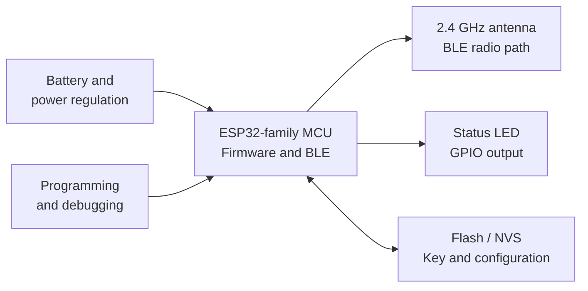
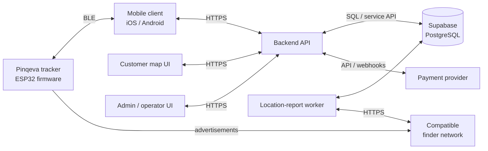
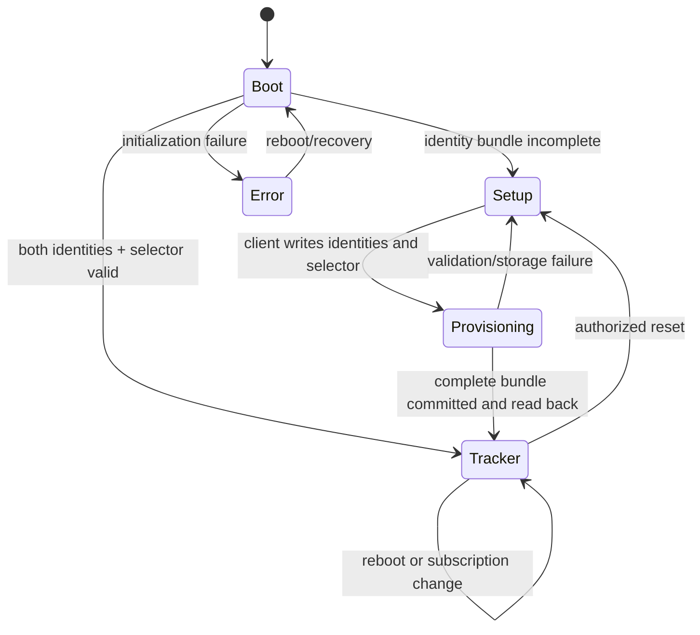

# Pinqeva System Architecture and Communication Protocol

> **Document version:** 0.6 — Dual finding networks and premium cloud services<br>
> **Date:** 28 August 2026<br>
> **Repository:** [PROJECT_PINKEVA_TAG_w_SUBS](https://github.com/Th0masclassic/PROJECT_PINKEVA_TAG_w_SUBS)<br>
> **Purpose:** Architecture baseline before client and server development

*Always know what is near.*

This is a living architecture document. It explicitly separates behavior already implemented in the test project from behavior proposed for the complete Pinqeva product.

> **Current subscription boundary:** a provisioned tag advertises whenever both finder identities and one valid network selection are present. One account subscription is enforced by the backend for cloud location, retained history, alerts, safe zones, recovery sharing/reporting, and vehicle protection across all currently owned tags. Billing state is never sent to the tag.

## Motivation

People regularly misplace personal items such as wallets, keys, bags, cards, and even parked vehicles. A compact Bluetooth tracker can help an owner identify a nearby item and, when integrated with a compatible finder network, obtain time-stamped location reports generated by participating devices.

A particularly useful Pinqeva scenario is leaving a tracker inside a car. The application can remember the vehicle's information and show the latest reported position on the Pinqeva map. This helps the owner find a parked car and may also assist after theft. In that situation, compatible phones travelling inside or passing near the stolen vehicle may anonymously relay the tracker's signal to the finder network. Ironically, a compatible device carried by someone moving with the vehicle may contribute to reporting the vehicle's location.

This is a crowd-sourced location mechanism, not a covert, continuous GPS system. Reports depend on nearby compatible devices, network availability, and the finder service. They can be delayed or absent, and platform anti-stalking protections may notify a person travelling with an unknown tracker. Pinqeva must display each report's timestamp and must not promise an exact, real-time, or guaranteed stolen-vehicle recovery service.

Pinqeva combines this tracking capability with a dedicated mobile experience, clear device ownership, an in-application map, and subscription-controlled cloud services. The public-key BLE payload remains independent of billing; an active subscription unlocks Pinqeva location retrieval and premium safety features. Pinqeva is therefore an end-to-end system composed of physical hardware, firmware, a mobile client, a backend service, a database, subscription management, an administration interface, and a map where an authenticated owner can view the latest available position and location history.

Defining the architecture and protocol before implementing the client and server reduces ambiguity between components. The firmware and mobile application must agree on Bluetooth services, key sizes, message formats, state transitions, result codes, and recovery behavior. The mobile application and backend must also agree on authentication, device ownership, subscription state, and location-report APIs.

The current repository contains ESP32 test firmware, experimental Apple Find My report-retrieval scripts, an anisette test server, and a Supabase/PostgreSQL schema for users, devices, ownership, plans, subscriptions, invoices, and payment events. This document organizes these elements into one coherent target architecture.

## Índice

1. [Introduction](#1-introduction)
2. [Hardware Architecture](#2-hardware-architecture)
3. [Software Architecture](#3-software-architecture)
4. [Communication Protocol](#4-communication-protocol)
5. [Current Implementation Status and Next Milestone](#5-current-implementation-status-and-next-milestone)
6. [Conclusion](#6-conclusion)

## 1. Introduction

### 1.1 Purpose

This document defines the hardware architecture, software architecture, and communication boundaries of the Pinqeva tracker system. It guides the next development stages: completing firmware provisioning, building the mobile client, implementing the backend, and connecting the map and subscription experience.

### 1.2 Scope

The complete system contains:

- A battery-powered Bluetooth tracker controlled by an ESP32-family microcontroller.
- Embedded firmware with setup, tracker, and bounded maintenance modes.
- An iOS/Android client application for provisioning, management, and location display.
- A backend API responsible for authentication, device ownership, key lifecycle, subscriptions, and location access.
- A PostgreSQL database currently managed through Supabase.
- A background worker that retrieves and processes finder-network location reports.
- A customer map interface for current and historical locations.
- An optional vehicle profile associated with a tracker, containing owner-provided details such as vehicle nickname, make, model, year, colour, and registration number.
- An administration interface for support and operational management.
- A payment-provider integration for subscription and invoice events.

Pinqeva must be described as a Bluetooth item tracker rather than an AirTag. Apple Find My and Google Find Hub support are experimental in the current project. A commercial product requires both platforms' applicable program enrollment, approval, anti-stalking behavior, and certification.

The tracker does not contain GNSS, cellular connectivity, or UWB. It therefore does not independently calculate or transmit its global position. Nearby BLE can provide discovery and a rough signal-strength indication. Global map coordinates are obtained from compatible finder-network reports and processed by the backend.

When the tracker is placed in a car, Pinqeva retrieves the latest location report associated with the tag and combines it with the vehicle profile stored in the application. The tag cannot retrieve vehicle telemetry such as speed, fuel level, engine state, mileage, or diagnostic codes unless separate vehicle hardware is added in the future.

### 1.3 Status terminology

- **Current:** the behavior exists in the checked-in test firmware or database migrations.
- **Proposed:** the behavior belongs to the target design but is not yet fully implemented.

### 1.4 Architectural principles

- **BLE first:** the tracker communicates locally with the mobile application through Bluetooth Low Energy.
- **Least privilege:** users access only devices they actively own; administrative functions require separate authorization.
- **Private-key isolation:** the private key used to decrypt location reports never enters the tracker and remains in protected server-side storage.
- **Explicit device states:** firmware distinguishes unprovisioned, provisioning, active tracker, bounded maintenance, and error states.
- **Server authority:** identity, ownership, payments, subscription state, and location access are enforced by the backend.
- **No invented precision:** the UI shows the timestamp and freshness of crowd-sourced reports instead of presenting them as real-time GPS.
- **Cloud subscription enforcement:** the backend requires one active/trialing account period for location retrieval and premium safety services across all currently owned tags.
- **Radio independence:** subscription changes never require physical BLE synchronization and never disable a provisioned tag's public-key advertisement.

## 2. Hardware Architecture

### 2.1 Physical tracker

The prototype tracker consists of:

- An ESP32-family microcontroller with Bluetooth Low Energy.
- Integrated flash storage for firmware and persistent provisioning data.
- A status LED connected to a GPIO output.
- A 2.4 GHz antenna, integrated into the module or implemented on the PCB.
- A battery and power-regulation circuit.
- A programming and debugging connection.
- Optional future hardware such as a buzzer, push button, battery monitor, or charging circuit.

The provisioning configuration targets the classic ESP32 and compiles with ESP-IDF 5.4. The exact production module, flash capacity, GPIO mapping, memory use, RF design, and power profile must still be validated before the PCB is frozen.

### 2.2 Hardware block diagram



### 2.3 Microcontroller responsibilities

The microcontroller is responsible for:

- Initializing non-volatile storage and Bluetooth.
- Deriving a stable device identifier from the factory MAC address.
- Determining whether the Apple key, Google EID, startup-slot preference, and control key form a complete bundle.
- Starting connectable setup advertising when that bundle is incomplete.
- Exposing the provisioning GATT service to the mobile application.
- Validating and persistently storing both finder identities and the write-once startup-slot preference.
- Alternating connectable Apple and Google finder advertisements whenever provisioning is complete.
- Exposing the public DULT non-owner sound command and driving the piezo buzzer.
- Controlling the status LED and reporting initialization errors.

The microcontroller does not process payments, receive renewals, or decide whether a subscription is paid. The backend is authoritative for billing and cloud feature access. The microcontroller is also not responsible for user authentication, private-key storage, map rendering, or global report retrieval.

### 2.4 Bluetooth operating modes

| Mode | Advertising | Address | Interval | Connectable | Purpose |
|---|---|---|---|---|---|
| Setup | BLE setup advertisement | Public | 100–250 ms | Yes | Allow the mobile client to discover and provision a new tracker. |
| Tracker | Alternating Apple and Google advertisements | Random, derived independently from each identity | 250 ms events; 500 ms network slots | Yes | Target two Apple and two Google advertisement events per second and accept DULT sound commands. |
| Maintenance | Provisioning service plus continuing tracker identity | Dedicated setup address during window | 120-second physical window | Yes | Allow authorized reset, diagnostics, and firmware updates. |

During setup, the current firmware advertises the name `PKV-XXXXXXXXXXXX`, where the final twelve hexadecimal characters are derived from the factory MAC address. This identifier supports discovery and technical support, but it is not proof of ownership.

### 2.5 Persistent storage

**Current:** firmware stores the factory bootstrap key, Apple advertisement key, Google EID, startup-slot preference, and reset-control key as NVS blobs. It rejects invalid values, refuses ordinary replacement, commits and reads back identities, and exposes only their SHA-256 fingerprints. An owner release must carry a valid per-allocation HMAC before both identities, the preference, and control key are erased; the factory bootstrap key survives transfer. No subscription or entitlement state is stored on the tag.

**Proposed:** the storage module provides:

- Atomic storage of both finder identities and one startup-slot preference.
- A provisioning marker and storage-format version.
- Detection of erased values such as all `0xFF` bytes and invalid values such as all zeroes.
- Read-back verification before tracker activation.
- Controlled erase during an authorized factory reset.
- Compatibility with flash encryption in production.

NVS blob storage is suitable for the first runtime implementation. A dedicated encrypted partition can be adopted later if manufacturing or security requirements justify it.

### 2.6 LED feedback

| LED behavior | Meaning |
|---|---|
| Slow setup indication | Device is unprovisioned and waiting for the mobile application. |
| Short confirmation pattern | Provisioning completed successfully. |
| Repeated error pattern | Initialization, storage, or Bluetooth failure. |
| Off during normal tracking | Tracker is operating normally and conserving power. |

LED activity should be controlled by a task or timer so long visual patterns do not block Bluetooth event processing.

### 2.7 Power considerations

BLE advertising interval, transmission power, LED duration, CPU wake time, and the power-regulation circuit directly affect battery life. Persistent Wi-Fi or MQTT connectivity is not part of the low-power tracker path. Battery-life claims require measurements on the final PCB, antenna, battery, firmware, and enclosure.

## 3. Software Architecture

### 3.1 System overview



The tracker communicates directly only with nearby BLE clients and the finder network through advertisements. It does not communicate directly with the database, payment provider, administration interface, or map.

### 3.2 Firmware architecture

The firmware is divided into these responsibilities:

- **Application entry point:** initializes the LED and starts Bluetooth initialization in a FreeRTOS task.
- **BLE driver:** configures GAP advertising, registers GATT callbacks, manages connections, and schedules setup or dual-network tracker behavior.
- **Storage driver:** initializes NVS and will provide validated key save, load, and erase operations.
- **Utility and LED module:** controls GPIO output and provides visible error feedback.
- **Provisioning service:** owns the GATT database, characteristic handles, protocol validation, and transition to tracker mode.
- **Finder-frame scheduler:** builds both finder frames and alternates Apple and Google slots every 500 ms.
- **Buzzer driver:** drives the CPT-9019A-SMT-TR through ESP-IDF LEDC at the configured GPIO and 4 kHz nominal frequency.

### 3.3 Firmware state model



### 3.4 Mobile client application

The mobile client acts as the BLE central and GATT client. It is responsible for:

- User registration, login, and session management.
- Scanning for setup-mode devices advertising the Pinqeva service.
- Connecting to the selected tracker.
- Reading device identifier, firmware version, protocol version, and a fresh connection challenge.
- Relaying that challenge to the authenticated backend and writing the returned one-time authorization proof before sensitive operations.
- Requesting one Apple advertisement key, one Google development EID, and a startup-slot preference from the backend.
- Writing the same dual-identity bundle on Android and iOS; the phone platform does not change tracker behavior.
- Waiting for explicit success before displaying completion.
- Registering the device and ownership relationship with the backend.
- Displaying owned devices, subscription status, latest location, and location history.
- Rendering locations inside the Pinqeva map UI.
- Allowing the owner to classify a tracker as a vehicle tracker and store or retrieve its vehicle profile.
- Displaying vehicle location freshness, including observation time and whether the car is currently nearby or only has a historical report.
- Supporting future nearby actions such as ringing the tracker.

The application must not infer global location from BLE signal strength. RSSI can support a rough nearby indication; global map coordinates come from the backend.

### 3.5 Backend API

The backend is the authority for identity, ownership, subscriptions, and location access. It is responsible for:

- Authenticating users and validating sessions.
- Decrypting a device-specific factory bootstrap key only long enough to issue a challenge-bound BLE authorization proof; never returning that reusable key to the app.
- Atomically starting/resuming permanent per-device key allocations and completing ownership only after tag fingerprint confirmation.
- Enforcing one active owner and coordinating authenticated release without changing the account subscription.
- Generating or securely importing finder-network key pairs.
- Keeping private keys in protected server-side storage.
- Returning only the advertisement public key to the authorized client.
- Enforcing active/trialing subscription access for cloud location and premium services without contacting the tag.
- Continuously collecting provider-tagged reports, retaining them for at most 30 days, and evaluating phone-aware safe-zone, separation, and movement alerts idempotently.
- Issuing hashed, expiring, revocable recovery shares and owner recovery reports.
- Binding a device identifier to its owner after successful provisioning.
- Enforcing ownership checks on every device and location request.
- Exposing device, map, vehicle, plan, subscription, invoice, and account APIs.
- Receiving signed and idempotent payment webhooks.
- Writing auditable administrative and security events.
- Coordinating the location-report worker.

The mobile application must never contain database administrator credentials, payment-provider secrets, or server private keys.

### 3.6 Location-report worker, map, and vehicle profiles

The location-report worker retrieves encrypted reports from the compatible finder network, matches each report to a device key, decrypts the report server-side, validates its timestamp and coordinate range, and stores a normalized location record.

The map requests the latest location or a bounded history from the backend. A response should contain latitude, longitude, observation time, confidence or accuracy information when available, and an indication that the value is a historical crowd-sourced report rather than a real-time GPS position.

For a tracker assigned to a car, the map presents the vehicle profile together with the latest report. The main vehicle screen should show the vehicle name, make/model, registration number when the owner chooses to store it, last reported coordinates, observation time, report age, and a clear **last reported** status. Location history may show movement between reports, but it must not draw an invented continuous route between sparse observations.

In a possible theft scenario, compatible devices in or near the moving car may anonymously relay its Bluetooth advertisement. This can help the owner provide recent information to the appropriate authorities, but Pinqeva should advise users not to confront a suspected thief or attempt recovery themselves.

A future `location` table should contain at least:

- `id` and `device_id`.
- `observed_at` and `received_at`.
- `latitude` and `longitude`.
- Confidence or accuracy metadata.
- Report source.
- Protected raw-report metadata only when retention is justified.

An optional one-to-one `vehicle_profile` record should contain:

- `device_id`.
- Owner-defined vehicle nickname.
- Make, model, year, and colour.
- Registration number, stored only when the owner chooses to provide it.
- Optional notes useful for identifying the vehicle.
- Creation and update timestamps.

Vehicle profiles follow the same ownership rules as trackers. Registration numbers, precise locations, and location history are personal data. Retention, export, deletion, encryption, and exceptional-access policies must be defined before production.

### 3.7 Database architecture

The existing Supabase migrations define these entities:

| Entity | Responsibility |
|---|---|
| `profiles` | Application profile linked to a Supabase authenticated user. |
| `device` | Tracker identity, name, status, and firmware version. |
| `ownership` | Time-bounded relationship between a user and a device. |
| `plan` | Available subscription plan, duration, and price. |
| `subscription` | Account cloud-service billing period; nullable `device_id` is historical checkout-origin context only. |
| `device_location_sync_state` | Backend-only leased collector schedule for eligible premium trackers. |
| `device_location_report` | Owner/session-bound premium report retained for at most 30 days. |
| `device_safe_zone` | Premium geofence definition and last evaluated transition state. |
| `device_protection_profile` | Phone-aware separation and movement/vehicle settings. |
| `device_recovery_share` | Hashed, expiring, revocable scoped recovery link. |
| `invoice` | Financial record associated with a subscription. |
| `payment_event` | Idempotent record of payment-provider webhook events. |

Row Level Security currently limits profile, ownership, and device reads to the authenticated user. Before production, policies must also protect subscriptions, invoices, location reports, provisioning sessions, and future tables. A device must have at most one active ownership record, and ownership transfer must be explicit and audited.

### 3.8 Subscription architecture

A subscription belongs to `subscription.user_id` and covers every tracker that
account currently owns. At most one current/nonterminal row may exist per
account. `subscription.device_id` is nullable historical checkout-origin data,
not an entitlement key. Terminal `cancelled` and `ended` rows remain as billing
history and do not prevent a later account subscription.

The backend is authoritative for billing. An active or trialing account period unlocks cloud location requests, continuously collected history retained for up to 30 days, phone-aware safe-zone/separation alerts, movement alerts, vehicle protection, recovery links/reports, and tracker freshness/health information. Expired or absent periods receive HTTP 402 from premium endpoints. Existing configurations remain stored so they can resume after renewal, while expiring share links stop resolving immediately and the location collector removes the account's jobs.

The tag has no permanent Internet connection and does not need one for this model. Its finder payload is derived only from the stored identities and selector. A signed Stripe webhook advances or ends cloud access immediately, without a BLE maintenance session. The removed development entitlement transport has no route, table, or radio role in the current system.

Payment webhooks must be signature-verified and idempotent before changing subscription state. Reset, safety behavior, anti-stalking behavior, and critical firmware recovery remain available regardless of subscription state.

### 3.9 Administration and operator interface

The administration interface belongs in the software architecture because operators interact with users, devices, subscriptions, payments, and support cases. It does not require a separate hardware protocol.

It should use a separate authorization domain with role-based access control and multi-factor authentication. It may provide:

- Device lookup by internal ID or serial number.
- Firmware and last-seen status.
- Ownership history without silent ownership reassignment.
- Subscription, invoice, and payment-event status.
- Audited support actions such as session revocation or reset approval.
- Security and operational audit events.

Administrators should not routinely view private keys or precise location history. Exceptional access must have a defined support purpose and produce an audit record.

### 3.10 Security boundaries

The most important trust boundaries are:

- Between an unknown nearby phone and a setup-mode tracker.
- Between the mobile application and the backend API.
- Between ordinary users and administrative functions.
- Between application services and private-key storage.
- Between the payment provider and webhook receiver.
- Between location data and any requester.

Protocol v1.8 retains capability `0x20` for the current non-bonding development transport, `0x40` for authenticated UTC synchronization, `0x80` for signed dual-slot BLE firmware updates, `0x0100` for dual-network provisioning, and adds `0x0200` for the implemented public DULT sound command. Manufacturing injects one random 32-byte bootstrap key into each production tag and stores an independently encrypted copy in the backend. On every connection the tag generates a fresh challenge; an authenticated app relays it to the backend and writes back the HMAC proof. Firmware rejects sensitive writes before verification, disconnects an invalid proof immediately, and closes a connection that remains unauthorized for 30 seconds. The checked-in development profile bypasses bootstrap verification and OS-level GATT encryption for hardware testing; production must replace that transport with an audited application-layer confidential channel plus physical presence/OOB.

## 4. Communication Protocol

### 4.1 Communication interfaces

| Interface | Transport | Participants | Purpose |
|---|---|---|---|
| Provisioning | BLE GATT | Mobile client and tracker | Identify and activate a new tracker. |
| Nearby control | BLE GATT | Mobile client and tracker | Future status, ring, reset, and diagnostics. |
| Application API | HTTPS with JSON | Mobile, map, admin, and backend | Authentication, devices, subscriptions, vehicles, and locations. |
| Database | PostgreSQL protocol | Backend, worker, and database | Durable application state. |
| Report retrieval | HTTPS | Worker and finder service | Retrieve encrypted location reports. |
| Payments | HTTPS API/webhooks | Backend and payment provider | Subscription and invoice lifecycle. |

### 4.2 Setup advertising protocol

An unprovisioned tracker sends a connectable BLE advertisement containing standard flags and the complete local name `PKV-XXXXXXXXXXXX`. The target implementation also advertises the Pinqeva Provisioning Service UUID so the client does not rely only on a name prefix.

The client scans for the service UUID, displays candidate device identifiers, and connects after user selection. Setup advertising resumes after an unexpected disconnect while the device remains unprovisioned.

### 4.3 Pinqeva Provisioning GATT service

The following UUIDs define implemented provisioning protocol version 1.8.

| Attribute | UUID | Properties | Value |
|---|---|---|---|
| Provisioning Service | `a6f0f000-3e4d-4b1a-9c2e-72d24c8f0a01` | Primary service | Contains all provisioning characteristics. |
| Protocol Information | `a6f0f001-3e4d-4b1a-9c2e-72d24c8f0a01` | Read | Protocol version, firmware version, and capabilities. |
| Device Identifier | `a6f0f002-3e4d-4b1a-9c2e-72d24c8f0a01` | Read | UTF-8 `PKV-XXXXXXXXXXXX`. |
| Apple Advertisement Key | `a6f0f003-3e4d-4b1a-9c2e-72d24c8f0a01` | Write with response | Exactly 28 raw binary P-224 X-coordinate bytes. |
| Provisioning Status | `a6f0f004-3e4d-4b1a-9c2e-72d24c8f0a01` | Read and Notify | Current state and result code. |
| Key Fingerprint | `a6f0f005-3e4d-4b1a-9c2e-72d24c8f0a01` | Read; application-channel protection required in production | SHA-256 of the 28-byte key, or 32 zero bytes when empty. |
| Tag Control Key | `a6f0f006-3e4d-4b1a-9c2e-72d24c8f0a01` | Write with response; application-channel protection required in production | One-time 32-byte secret for authenticated reset; identical setup retries only. |
| Authenticated Reset | `a6f0f007-3e4d-4b1a-9c2e-72d24c8f0a01` | Write with response; application-channel protection required in production | 32-byte nonce plus 32-byte HMAC; erases both identities, selector, and control material after verification. |
| Tag Challenge | `a6f0f008-3e4d-4b1a-9c2e-72d24c8f0a01` | Read | Fresh random 32-byte value generated for each BLE connection. |
| Tag Authorization Proof | `a6f0f009-3e4d-4b1a-9c2e-72d24c8f0a01` | Write with response | `HMAC-SHA256(device_bootstrap_key, domain || serial || challenge)`. Unlocks sensitive writes for this connection only. |
| Google Advertisement EID | `a6f0f00a-3e4d-4b1a-9c2e-72d24c8f0a01` | Write with response; application-channel protection required in production | Exactly 20 raw bytes for the Google Find Hub development frame. |
| UTC Time | `a6f0f00b-3e4d-4b1a-9c2e-72d24c8f0a01` | Write with response; backend-authorized connection required | Eight-byte unsigned Unix UTC seconds, big-endian. Persisted immediately and checkpointed hourly. |
| Firmware Manifest | `a6f0f00c-3e4d-4b1a-9c2e-72d24c8f0a01` | Write with response; authorized physical maintenance window | Fixed 115-byte signed release manifest. |
| Firmware Data | `a6f0f00d-3e4d-4b1a-9c2e-72d24c8f0a01` | Write with or without response; authorized active transfer | Ordered raw ESP application-image chunks. |
| Firmware Control | `a6f0f00e-3e4d-4b1a-9c2e-72d24c8f0a01` | Write with response | One-byte command: `0x01` commit or `0x02` abort. |
| Firmware Status | `a6f0f00f-3e4d-4b1a-9c2e-72d24c8f0a01` | Read | State, result, and big-endian received-byte count. |
| Exact Firmware Version | `a6f0f010-3e4d-4b1a-9c2e-72d24c8f0a01` | Read | Three bytes: major, minor, and patch. |
| Google Key Fingerprint | `a6f0f011-3e4d-4b1a-9c2e-72d24c8f0a01` | Read; application-channel protection required in production | SHA-256 of the 20-byte Google EID, or 32 zero bytes when empty. |
| Finding Network | `a6f0f012-3e4d-4b1a-9c2e-72d24c8f0a01` | Read/write with response | Legacy one-byte startup preference: `0x00` empty, `0x01` Apple first, or `0x02` Google first. Both networks are advertised. Write-once until authenticated reset. |

GATT values are raw binary, not Base64 text. The client requests a suitable MTU, while firmware supports handle-bound prepared writes for every sensitive value, including authorization proof, UTC value, both identities, reset command, and firmware manifest. Partial, mixed-handle, or uncommitted data is zeroed and never reaches storage.

The tracker also exposes the public DULT service
`15190001-12F4-C226-88ED-2AC5579F2A85` and non-owner accessory-control
characteristic `8E0C0001-1D68-FB92-BF61-48377421680E`. The implemented subset accepts
little-endian Sound Start (`0x0300`) and Sound Stop (`0x0301`), indicates command
responses (`0x0302`), and indicates natural or requested completion (`0x0303`). A
start drives the configured buzzer for at most 12 seconds. This public anti-stalking
command is not a substitute for Apple MFi owner Play Sound or Google's certified
Find Hub ring path.

### 4.4 Protocol Information value

| Offset | Size | Field |
|---|---|---|
| 0 | 1 byte | Protocol major version |
| 1 | 1 byte | Protocol minor version |
| 2 | 1 byte | Firmware major version |
| 3 | 1 byte | Firmware minor version |
| 4 | 2 bytes | Capability flags, little-endian |

An incompatible major version stops provisioning. A newer minor version can be accepted when the required characteristics and capability flags are present.

Capability flags are little-endian. The implemented update path requires both
the challenge/proof flag `0x0010` and signed-OTA flag `0x0080`. Dual setup also
requires `0x0100`; the public DULT sound subset is advertised with `0x0200`. The
Protocol Information value carries only firmware major and minor for backward
compatibility; update clients read the exact three-byte Firmware Version
characteristic before comparing or acknowledging a release.

### 4.5 Provisioning Status value

Provisioning Status contains two bytes: one state byte followed by one result byte.

| State | Value | Meaning |
|---|---|---|
| Unprovisioned | `0x00` | The dual-network identity bundle is incomplete. |
| Receiving | `0x01` | Identity or selector write is in progress. |
| Validating | `0x02` | Completed value is being validated. |
| Persisting | `0x03` | Key is being written and read back. |
| Ready | `0x04` | Provisioning succeeded. |
| Error | `0x7F` | Result byte identifies the failure. |

| Result | Value | Meaning |
|---|---|---|
| Success | `0x00` | Operation completed. |
| Invalid length | `0x01` | A value does not have its exact protocol length. |
| Invalid value | `0x02` | Key value is erased or rejected. |
| Storage failure | `0x03` | Save or read-back failed. |
| Already provisioned | `0x04` | Replacement is not allowed. |
| Unauthorized | `0x05` | The connection proof is missing or invalid. |
| Unsupported version | `0x06` | Protocol versions are incompatible. |
| Network rejected | `0x07` | The selector is invalid or attempts to replace a committed network. |
| Internal error | `0x7F` | Unclassified firmware failure. |

### 4.6 Key lifecycle

The finder allocation contains an Apple P-224 key pair, a Google 32-byte identity key with a derived 20-byte EID, and one startup-slot preference. Its lifecycle is deliberately separate from the factory bootstrap key:

1. Manufacturing injects a unique bootstrap key into protected tag NVS and stores an encrypted backend copy. Owner reset never erases this factory key.
2. For each connection, the backend returns only a challenge-bound HMAC proof; the app never receives the reusable bootstrap key.
3. After firmware accepts the proof, the backend locks the device and checks the permanent allocation against both tag-read fingerprints and selector.
4. If an allocation exists, the backend resumes that exact bundle. It generates material only when no live allocation exists and all three tag values report empty.
5. The backend encrypts both private identity secrets with session-bound AES-256-GCM and binds the allocation to the device in the same transaction.
6. The backend sends only the 28-byte Apple advertisement key, 20-byte Google EID, startup-slot preference, and domain-separated control key to the app.
7. The mobile client installs the control key, Google EID, selector, and Apple key over protected BLE. Each value is write-once and an identical interrupted retry is accepted.
8. The tracker validates, stores, reads back, and exposes only both SHA-256 fingerprints plus the selector.
9. Backend ownership is created only after the complete binding is relayed and matched.
10. The tracker derives an address for each identity and alternates both advertising payloads.
11. The backend queries every configured provider concurrently, validates all reports, and projects the newest report across Apple and Google, subject to account-level cloud subscription access.

Neither the Apple private scalar nor Google identity key may be written to the tracker, displayed in administration, logged, or stored in ordinary mobile application storage.

### 4.7 Experimental dual finding-network scheduler

The tag stores both public advertising identities. The Apple slot is a 31-byte
manufacturer advertisement using company identifier `0x004C`, offline-finding
type `0x12`, and the 28-byte P-224 X coordinate. The Google slot is the 29-byte
legacy Find Hub Network frame `02 01 06 19 16 AA FE 41`, followed by the 20-byte
secp160r1 EID and a hashed-flags byte. One legacy BLE advertising set alternates
between Apple and Google every 500 ms with a 250 ms event interval, targeting two
advertisements per network per second. The stored preference only decides which
slot is emitted first after boot.

This dual schedule is an interoperability experiment, not a certifiable product
claim. Google's published Find Hub Network specification says a switchable
accessory must activate only one network at a time. Apple owner-network accessory
behavior requires the MFi/Find My program. Shipping dual broadcasts therefore
requires written platform approval, RF/power testing, anti-stalking review, and
the official onboarding/certification paths.

The current Google EID is derived from the encrypted 32-byte identity key using
the published AES-256/secp160r1 algorithm at counter zero. The GitHub bridge
refreshes every registered development identity in one account-wide background
operation every three days, before the four-day deadline, while the
20-byte value stored in the tag remains unchanged; that avoids recurring BLE
writes but remains a development integration with no Google service guarantee.
The backend attempts both configured providers for every location refresh and
still returns one provider's valid reports if the other is unavailable.

### 4.8 Signed firmware-update protocol

The backend publishes at most one classic-ESP32 application release. Its
version, byte length, and SHA-256 digest are encoded in a 42-byte manifest body.
The body is followed by a one-byte DER signature length and a P-256
ECDSA/SHA-256 signature padded to 72 bytes, producing a fixed 115-byte manifest.
The matching private key stays in the backend; firmware embeds only the public
verification key.

An update requires active ownership, a fresh tag challenge, the physical
two-minute maintenance window, and a strictly newer version. The app verifies
the downloaded image's digest and manifest binding before transfer. Firmware
verifies the signature and target, writes ordered chunks directly to the
inactive 896 KiB OTA partition while hashing them, compares the final digest,
lets ESP-IDF validate the application image, and only then changes the boot
partition. Disconnecting before commit aborts the inactive write without
affecting the running slot.

Rollback is enabled. A newly booted image that cannot initialize BLE marks
itself invalid and reboots into the previous slot. A healthy image exposes a
temporary maintenance connection so the app can read the exact running version
and acknowledge it to the backend. If acknowledgement is interrupted, the next
session can reconcile the already-installed equal version without reflashing.
The first migration from the historical single-app partition table is wired;
the migration layout preserves the existing NVS range.

### 4.9 Provisioning sequence

```mermaid
sequenceDiagram
    participant App as Mobile client
    participant API as Backend API
    participant Store as Database / key store
    participant Tag as Pinqeva tracker

    App->>Tag: BLE connect
    App->>Tag: Read version, ID, challenge, both fingerprints, selector
    Tag-->>App: PKV ID + complete observed dual-network state
    App->>API: Create request (ID + challenge + observed tag state)
    API->>Store: Verify factory credential; reserve one 30-minute request
    API-->>App: Request ID + server plan catalog with prices
    App->>API: Choose plan and create Stripe Checkout
    API-->>App: Hosted Checkout URL
    App->>API: Poll request status (webhook is authoritative)
    API->>Store: Verify signed Stripe event; bind active subscription; mark paid
    API-->>App: paid + bounded claim deadline
    App->>Tag: BLE reconnect and read a fresh challenge
    App->>API: Start claim (paid request + challenge + tag state + desired network)
    API->>Store: Lock device; reuse allocation or generate once; bind immediately
    API-->>App: One-time proof + action + Apple key + Google EID + selector + control key
    App->>Tag: Write authorization proof
    Tag-->>App: Connection authorized
    alt Tag is empty
        App->>Tag: Write control, Google EID, selector, Apple key
        Note over Tag: Validate, commit, and read back
        Tag-->>App: Ready / Success
    else Complete matching bundle already exists
        Note over App: Never rewrite the tag
    end
    App->>Tag: Read both fingerprints and selector after persistence
    App->>API: Complete claim (complete binding + completion capability)
    API->>Store: Create ownership
    API-->>App: Registered device (claimed; next action ready)
    Tag-->>App: Dual finder advertising already enabled
```

The unpaid request expires after a bounded short-lived window. A paid request receives the
configured claim deadline and is marked completed only after the tag reports
the expected dual-network binding. If BLE succeeds but completion fails, the client
resumes the same allocation. A passed deadline or mismatch enters recovery and
never causes automatic regeneration. The mobile client polls request status
instead of depending on a socket connection; the signed provider webhook is
the source of truth and polling only observes the committed state.

Transfer is another two-phase operation: the current owner requests a reset command after both fingerprints and the selector match, the tag verifies the HMAC and erases both identities, selector, and control key, and the app confirms all three public values are empty. Only then does the backend end ownership, revoke the allocation, clear that tag's retained location binding, and allow a new owner to generate a fresh dual-network bundle. The former owner's account subscription is unchanged.

### 4.10 Tracker advertising protocol

The firmware constructs the 31-byte Apple manufacturer frame and the 29-byte
Google service-data frame described in section 4.7, then time-slices them on one
legacy advertising set. Both public identities and one valid startup preference
are required before tracker mode starts. Account subscription state remains in
the backend and never changes either frame or requests a tag synchronization.

Tracker advertising is connectable so the public DULT sound service can receive
anti-stalking sound commands. Connection scheduling, battery life, abuse resistance,
and compatibility must be measured on physical hardware before production.

### 4.11 Proposed application HTTPS API

| Operation | Example route | Authorization |
|---|---|---|
| Create payment-gated provisioning request | `POST /v1/provisioning/requests` | Authenticated user + fresh tag challenge |
| Read provisioning request | `GET /v1/provisioning/requests/{requestId}` | Request owner |
| Open provisioning Checkout | `POST /v1/provisioning/requests/{requestId}/checkout` | Request owner + server plan code |
| Start/resume device claim | `POST /v1/devices/claim` | Authenticated user + paid request + fresh tag challenge |
| Complete device claim | `POST /v1/devices/claim/complete` | Allocation owner + completion capability |
| Start device release | `POST /v1/devices/{deviceId}/release` | Active owner + connected-tag fingerprint |
| Complete device release | `POST /v1/devices/{deviceId}/release/complete` | Active owner + release capability + empty tag |
| List owned devices | `GET /v1/devices` | Authenticated owner |
| Read one device | `GET /v1/devices/{deviceId}` | Active owner or authorized operator |
| Rename device | `PATCH /v1/devices/{deviceId}` | Active owner |
| Read vehicle profile | `GET /v1/devices/{deviceId}/vehicle` | Active owner |
| Create/update vehicle profile | `PUT /v1/devices/{deviceId}/vehicle` | Active owner |
| Latest location report | `POST /v1/devices/{deviceId}/location/report` | Active owner; safe latest projection only |
| 24-hour location reports | `POST /v1/devices/{deviceId}/location/report_24h` | Active owner; decrypted coordinates/timestamps only |
| 1–30 day premium history | `POST /v1/devices/{deviceId}/location/history?days=30` | Active subscribed owner |
| Delete retained history | `DELETE /v1/devices/{deviceId}/location/history` | Active owner, even after expiry |
| Read premium capability flags | `GET /v1/devices/{deviceId}/premium/features` | Active owner |
| Read tracker protection overview | `GET /v1/devices/{deviceId}/premium/overview` | Active subscribed owner |
| Manage safe zones | `GET/POST/PATCH/DELETE /v1/devices/{deviceId}/safe-zones` | Active subscribed owner |
| Manage separation/movement/vehicle protection | `GET/PATCH /v1/devices/{deviceId}/protection` | Active owner whose account is subscribed |
| Create/list/revoke recovery shares | `/v1/devices/{deviceId}/recovery-shares` | Active subscribed owner |
| Resolve scoped recovery share | `POST /v1/recovery-shares/resolve` | Valid hashed-token capability in the non-logged request body |
| Generate recovery report | `GET /v1/devices/{deviceId}/recovery-report` | Active subscribed owner |
| List plans | `GET /v1/plans` | Public or authenticated according to policy |
| Read account subscription | `GET /v1/subscription` | Authenticated account |
| Start account subscription Checkout | `POST /v1/subscription/checkout` | Authenticated account + server plan code |
| Open account billing portal | `POST /v1/subscription/portal` | Authenticated account with manageable subscription |
| Check firmware release | `GET /v1/devices/{deviceId}/firmware` | Active owner |
| Start/reconcile firmware update | `POST /v1/devices/{deviceId}/firmware/session` | Active owner + fresh tag challenge |
| Download firmware image | `GET /v1/devices/{deviceId}/firmware/image` | Active owner + exact release version |
| Acknowledge verified firmware | `POST /v1/devices/{deviceId}/firmware/acknowledge` | Active owner after tag-version read-back |
| Payment webhook | `POST /v1/webhooks/payments` | Valid payment-provider signature |

All application traffic uses HTTPS and schema-validated JSON. Ownership is checked server-side. Provisioning and payment retries use idempotency keys. Precise coordinates are never returned for a device the requester does not actively own.

### 4.12 Failure and recovery behavior

- A device with an incomplete identity bundle remains in setup mode.
- An interrupted transfer preserves every committed write-once value and resumes the same backend allocation.
- An invalid identity or selector produces an explicit error and does not activate tracker mode.
- A storage failure keeps the device in setup mode and activates an error indication.
- An unexpected disconnect restarts setup advertising.
- A provisioned device rejects key replacement unless an authorized reset flow is active.
- A complete stored bundle resumes alternating Apple and Google advertisements directly after reboot.
- Cloud premium APIs reject expired/absent subscriptions without changing the tag.
- Renewal advances cloud access immediately after the authoritative Stripe event and requires no BLE session.
- An interrupted OTA transfer leaves the current boot partition selected; an invalid new image rolls back, and an interrupted final acknowledgement can be reconciled without reflashing.
- Success is reported only after persistent read-back verification.
- Backend claim completion is idempotent so retries cannot create duplicate ownership records.
- Factory reset clears both identities, selector, control key, and ownership binding through an explicit, auditable process.

## 5. Current Implementation Status and Next Milestone

### 5.1 Implemented in the repository

- ESP32 application startup and FreeRTOS Bluetooth initialization task.
- GPIO LED initialization and blink/error utility.
- Device identifier derived from the factory MAC address.
- Setup, key-based tracker, and bounded physical maintenance modes for the provisioning slice.
- Connectable advertisement containing the provisioning service UUID, with the `PKV-` name in scan response data.
- Protocol-v1.9 GATT service with per-connection challenge/proof, explicit no-bond development capability, dual-network identity characteristics, write-once startup preference, authenticated UTC synchronization, signed OTA, owner-authorized Play/Pause, public DULT sound commands, and prepared writes.
- Validated factory-bootstrap plus one-time NVS identity/control persistence, complete read-back checks, authenticated owner-data erasure that preserves the bootstrap key, and BLE-bond cleanup after reset disconnect.
- React Native claim/release services that verify both fingerprints and the selector, avoid replacement, install partial retries safely, and confirm complete reset before backend release.
- Experimental 500 ms Apple/Google time-sliced advertising, restored after reboot and independent of subscription changes. The old entitlement transport is removed.
- CPT-9019A-SMT-TR LEDC driver with a non-extending 10-second owner ring, Pause, and the public DULT non-owner sound start/stop/complete subset.
- Cloud-side account premium feature access, 30-day owner/session-bound provider history, safe-zone/separation/movement alerts, vehicle protection, recovery shares/reports, and privacy deletion.
- Authenticated API that issues nonce-bound proofs, generates Apple P-224 and Google EIK/EID material once, encrypts private identities, binds allocations atomically, queries both configured report providers, deterministically projects the newest report, completes one ownership, and performs two-phase release.
- Supabase migrations for backend-only bootstrap credentials, encrypted key custody, permanent allocation markers, one active owner, release audit, subscription cancellation, and provider outbox delivery.
- Protocol-v1.9/firmware-v0.6.0 classic ESP32 normal and low-radio verification builds verified with ESP-IDF 5.4.4.
- Experimental key generation and report-retrieval scripts.
- Supabase tables for profiles, devices, ownership, plans, subscriptions, invoices, and payment events.
- Initial Row Level Security for profiles, ownership, and devices.

### 5.2 Not yet implemented or incomplete

- Physical-presence gating, MITM-resistant BLE association, and tag-signed provisioning receipts beyond the implemented backend-authentication proof.
- Product mobile UI around the checked-in provisioning service.
- Production KMS/HSM private-key wrapping and a horizontally scalable report-worker deployment.
- Customer-facing UI for the implemented recovery-report, trusted-sharing, companion-phone, alert-profile, replacement, and vehicle-protection APIs. Safe-zone CRUD is available, but still uses manual coordinates rather than a map picker.
- Production scheduling, batching, backoff, and capacity validation for the implemented durable dual-provider polling worker.
- Physical key-based advertising integration testing and production-grade payment/provider operations.
- Administrative roles, policies, audit events, and operator UI.
- Official Apple and Google accessory onboarding, certified owner ring/play-sound behavior, complete DULT compliance, rotating Google EIDs, and production power, RF, security, anti-stalking, and certification tests.

### 5.3 Next milestone

The next milestone validates authorization and the key-based subscription boundary on physical hardware:

1. Add an authenticated application-layer encrypted no-bond channel, physical presence/OOB, and a cryptographic provisioning receipt.
2. Reboot the tracker and verify that both identities persist and both schedules resume, without billing synchronization.
3. Expire and renew the cloud subscription and verify that premium APIs stop/resume while the BLE finder payload remains unchanged.
4. Validate identical iOS/Android provisioning plus both Apple and Google captures, persistence, reboot, DULT sound, maintenance, reset, and OTA on the target ESP32.
5. Replace the development envelope key with KMS/HSM-backed per-record data keys.

The milestone is complete when a blank tracker can be provisioned identically from either mobile platform, survives a reboot, emits the experimental dual finder schedule regardless of billing state, and exposes premium cloud features for all trackers only while the owning account is active or trialing.

## 6. Conclusion

Pinqeva is an end-to-end Bluetooth tracking platform rather than only an embedded firmware project. The same tag can protect personal items or be assigned to a vehicle, allowing the application to combine owner-provided car information with the latest crowd-sourced location report. If a vehicle is stolen, compatible devices travelling with or passing near the car may help report the tag's changing location, although availability and timing are not guaranteed.

The architecture separates low-power hardware from mobile onboarding, cloud location processing, subscriptions, vehicle and map presentation, and administration. The tracker stores only the material needed to advertise and reset safely, while the backend protects the private key and controls paid cloud access.

The current firmware distinguishes a complete dual-network identity bundle from a device that must remain in setup mode. A complete bundle and startup preference are sufficient for experimental alternating Apple and Google advertising after provisioning and reboot. Subscription expiry pauses location retrieval and premium safety services for the account in the backend, not the radio. The remaining work includes official finder-program integration, a certifiable Google rotation design, certified owner sound, an authenticated and confidential no-bond transport with physical presence/OOB, customer UI wiring for premium APIs, and physical hardware testing.
